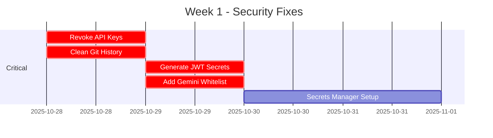
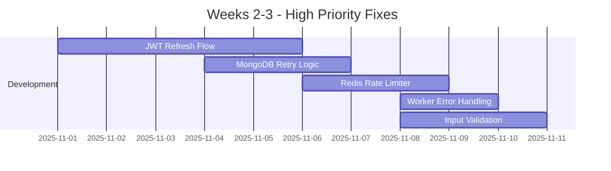

# WhatsDeX: Professional Action Plan & Enhancement Recommendations
**Date:** 2025-10-28  
**Version:** 1.4.13-alpha.1  
**Status:** Production Readiness Roadmap

---

## 📋 Table of Contents

1. [Critical Security Fixes](#critical-security-fixes)
2. [AI Enhancement Recommendations](#ai-enhancement-recommendations)
3. [Performance Optimizations](#performance-optimizations)
4. [Feature Enhancements](#feature-enhancements)
5. [Code Quality Improvements](#code-quality-improvements)
6. [Testing Strategy](#testing-strategy)
7. [Monitoring & Observability](#monitoring--observability)
8. [Implementation Timeline](#implementation-timeline)

---

## 🔐 CRITICAL SECURITY FIXES

### Fix 1: API Key Exposure Remediation
**Timeline:** IMMEDIATE (Today)  
**Effort:** 2-4 hours

#### Step-by-Step Implementation:

1. **Revoke Compromised Keys**
   ```bash
   # Document current keys before revoking
   echo "OpenAI Key (last 8): ...1DGsA" >> keys-revoked-$(date +%Y%m%d).txt
   echo "Gemini Key (last 8): ...AILpo" >> keys-revoked-$(date +%Y%m%d).txt
   echo "Stripe Key (last 8): ...1Ai00" >> keys-revoked-$(date +%Y%m%d).txt
   ```

2. **Clean Git History**
   ```bash
   # Install git-filter-repo
   pip install git-filter-repo
   
   # Remove .env from history
   git filter-repo --path .env --invert-paths --force
   
   # Verify .env is in .gitignore
   echo ".env" >> .gitignore
   git add .gitignore
   git commit -m "security: ensure .env is never committed"
   git push --force --all
   ```

3. **Implement Secrets Manager**
   ```javascript
   // services/secretsManager.js
   const AWS = require('aws-sdk');
   const secretsManager = new AWS.SecretsManager();
   
   class SecretsManager {
     async getSecret(secretName) {
       try {
         const data = await secretsManager.getSecretValue({ 
           SecretId: secretName 
         }).promise();
         return JSON.parse(data.SecretString);
       } catch (error) {
         logger.error('Failed to retrieve secret', { secretName, error: error.message });
         throw error;
       }
     }
     
     async rotateSecret(secretName) {
       // Implement automatic key rotation
       const newValue = this.generateSecureKey();
       await secretsManager.putSecretValue({
         SecretId: secretName,
         SecretString: JSON.stringify({ value: newValue })
       }).promise();
       
       logger.info('Secret rotated successfully', { secretName });
       return newValue;
     }
     
     generateSecureKey() {
       return require('crypto').randomBytes(32).toString('hex');
     }
   }
   
   module.exports = SecretsManager;
   ```

4. **Update Service Initialization**
   ```javascript
   // services/gemini.js
   const SecretsManager = require('./secretsManager');
   
   class GeminiService {
     constructor() {
       // Instead of: this.apiKey = process.env.GOOGLE_GEMINI_API_KEY;
       this.secretsManager = new SecretsManager();
     }
     
     async initialize() {
       const secrets = await this.secretsManager.getSecret('gemini-api-key');
       this.apiKey = secrets.value;
       this.genAI = new GoogleGenerativeAI(this.apiKey);
     }
   }
   ```

---

### Fix 2: JWT Authentication Hardening
**Timeline:** This Week  
**Effort:** 8-12 hours

#### Implementation:

1. **Token Refresh Flow**
   ```javascript
   // routes/auth.js
   const express = require('express');
   const jwt = require('jsonwebtoken');
   const router = express.Router();
   
   // Token blacklist (use Redis in production)
   const Redis = require('ioredis');
   const redis = new Redis(process.env.REDIS_URL);
   
   router.post('/refresh', async (req, res) => {
     try {
       const { refreshToken } = req.body;
       
       if (!refreshToken) {
         return res.status(401).json({ error: 'Refresh token required' });
       }
       
       // Verify refresh token
       const decoded = jwt.verify(refreshToken, process.env.JWT_REFRESH_SECRET);
       
       // Check if token is blacklisted
       const isBlacklisted = await redis.get(`blacklist:${refreshToken}`);
       if (isBlacklisted) {
         return res.status(401).json({ error: 'Token has been revoked' });
       }
       
       // Generate new tokens
       const newAccessToken = jwt.sign(
         { userId: decoded.userId, role: decoded.role },
         process.env.JWT_SECRET,
         { expiresIn: '15m' }
       );
       
       const newRefreshToken = jwt.sign(
         { userId: decoded.userId, role: decoded.role },
         process.env.JWT_REFRESH_SECRET,
         { expiresIn: '7d' }
       );
       
       // Blacklist old refresh token
       await redis.setex(`blacklist:${refreshToken}`, 7 * 24 * 60 * 60, '1');
       
       res.json({
         accessToken: newAccessToken,
         refreshToken: newRefreshToken
       });
     } catch (error) {
       logger.error('Token refresh failed', { error: error.message });
       res.status(401).json({ error: 'Invalid refresh token' });
     }
   });
   
   router.post('/logout', async (req, res) => {
     try {
       const { refreshToken } = req.body;
       
       // Blacklist refresh token
       await redis.setex(`blacklist:${refreshToken}`, 7 * 24 * 60 * 60, '1');
       
       res.json({ message: 'Logged out successfully' });
     } catch (error) {
       logger.error('Logout failed', { error: error.message });
       res.status(500).json({ error: 'Logout failed' });
     }
   });
   
   module.exports = router;
   ```

2. **Update Auth Middleware**
   ```javascript
   // middleware/auth.js
   const authenticateToken = async (req, res, next) => {
     try {
       // Rate limiting
       await authRateLimiter.consume(req.ip);
       
       const authHeader = req.headers['authorization'];
       const token = authHeader?.split(' ')[1];
       
       if (!token) {
         return res.status(401).json({ error: 'Access token required' });
       }
       
       // Check blacklist
       const isBlacklisted = await redis.get(`blacklist:${token}`);
       if (isBlacklisted) {
         return res.status(401).json({ error: 'Token has been revoked' });
       }
       
       // Verify token - REMOVE FALLBACK SECRET
       if (!process.env.JWT_SECRET) {
         throw new Error('JWT_SECRET environment variable is required');
       }
       
       jwt.verify(token, process.env.JWT_SECRET, (err, decoded) => {
         if (err) {
           logger.warn('JWT verification failed', { error: err.message, ip: req.ip });
           return res.status(403).json({ error: 'Invalid or expired token' });
         }
         
         req.user = {
           id: decoded.userId,
           role: decoded.role || 'admin',
           permissions: decoded.permissions || []
         };
         
         next();
       });
     } catch (error) {
       logger.error('Authentication failed', { error: error.message });
       res.status(500).json({ error: 'Authentication failed' });
     }
   };
   ```

---

## 🤖 AI ENHANCEMENT RECOMMENDATIONS

### Enhancement 1: Advanced Conversation Context Management
**Value:** Improved user experience, better AI responses  
**Effort:** 1-2 weeks

#### Current Limitation:
AI chat history is summarized after 16 messages, potentially losing important context.

#### Proposed Solution: Semantic Memory System

```javascript
// services/semanticMemory.js
const { GoogleGenerativeAI } = require('@google/generative-ai');

class SemanticMemoryService {
  constructor() {
    this.genAI = new GoogleGenerativeAI(process.env.GOOGLE_GEMINI_API_KEY);
    this.embedModel = this.genAI.getGenerativeModel({ model: 'embedding-001' });
    this.vectorStore = null; // Initialize vector database (Pinecone/Weaviate)
  }
  
  async storeConversation(userId, messages) {
    // Generate embeddings for message chunks
    const embeddings = await this.generateEmbeddings(messages);
    
    // Store in vector database with metadata
    await this.vectorStore.upsert({
      vectors: embeddings.map((emb, idx) => ({
        id: `${userId}-msg-${Date.now()}-${idx}`,
        values: emb,
        metadata: {
          userId,
          content: messages[idx].content,
          role: messages[idx].role,
          timestamp: Date.now()
        }
      }))
    });
  }
  
  async retrieveRelevantContext(userId, currentQuery, topK = 5) {
    // Generate embedding for current query
    const queryEmbedding = await this.generateEmbedding(currentQuery);
    
    // Semantic search in vector store
    const results = await this.vectorStore.query({
      vector: queryEmbedding,
      filter: { userId },
      topK,
      includeMetadata: true
    });
    
    // Return relevant past conversations
    return results.matches.map(match => ({
      content: match.metadata.content,
      relevanceScore: match.score,
      timestamp: match.metadata.timestamp
    }));
  }
  
  async generateEmbedding(text) {
    const result = await this.embedModel.embedContent(text);
    return result.embedding.values;
  }
  
  async generateEmbeddings(messages) {
    const embeddings = [];
    for (const msg of messages) {
      const embedding = await this.generateEmbedding(msg.content);
      embeddings.push(embedding);
    }
    return embeddings;
  }
}

// Usage in commands/ai-chat/gemini.js
const semanticMemory = new SemanticMemoryService();

// Before generating response
const relevantContext = await semanticMemory.retrieveRelevantContext(userId, input);
const systemMessage = `You are a helpful assistant.
${currentSummary ? `\n\nConversation summary:\n${currentSummary}` : ''}
${relevantContext.length > 0 ? `\n\nRelevant past context:\n${relevantContext.map(c => c.content).join('\n')}` : ''}`;
```

**Benefits:**
- 🎯 More accurate responses with relevant historical context
- 📚 Unlimited conversation history (not limited by token count)
- 🔍 Semantic search across all user interactions
- 💰 Cost-effective (retrieve only relevant messages)

---

### Enhancement 2: Multi-Model AI Router with Fallback
**Value:** Higher reliability, cost optimization  
**Effort:** 1 week

```javascript
// services/aiRouter.js
class AIRouterService {
  constructor() {
    this.providers = {
      primary: new GeminiService(),
      secondary: new OpenAIService(process.env.OPENAI_API_KEY),
      fallback: new DeepSeekService()
    };
    
    this.healthStatus = new Map();
    this.startHealthMonitoring();
  }
  
  async getChatCompletion(messages, options = {}) {
    const providers = ['primary', 'secondary', 'fallback'];
    
    for (const providerName of providers) {
      try {
        // Check health status
        if (this.healthStatus.get(providerName) === 'unhealthy') {
          logger.warn(`Skipping unhealthy provider: ${providerName}`);
          continue;
        }
        
        const provider = this.providers[providerName];
        const startTime = Date.now();
        
        const response = await provider.getChatCompletion(messages);
        const responseTime = Date.now() - startTime;
        
        // Log successful usage
        logger.info('AI provider response', {
          provider: providerName,
          responseTime,
          messageCount: messages.length
        });
        
        // Track costs
        await this.trackUsage(providerName, messages, response);
        
        return response;
      } catch (error) {
        logger.warn(`AI provider ${providerName} failed`, {
          error: error.message,
          attemptingNext: providers.indexOf(providerName) < providers.length - 1
        });
        
        // Mark as unhealthy
        this.healthStatus.set(providerName, 'unhealthy');
        
        // If last provider, throw error
        if (providerName === providers[providers.length - 1]) {
          throw new Error('All AI providers failed');
        }
      }
    }
  }
  
  async startHealthMonitoring() {
    // Check provider health every 5 minutes
    setInterval(async () => {
      for (const [name, provider] of Object.entries(this.providers)) {
        try {
          const health = await provider.healthCheck();
          this.healthStatus.set(name, health.status);
        } catch (error) {
          this.healthStatus.set(name, 'unhealthy');
        }
      }
    }, 5 * 60 * 1000);
  }
  
  async trackUsage(provider, messages, response) {
    // Estimate token usage and costs
    const estimatedTokens = messages.reduce((sum, msg) => sum + msg.content.length / 4, 0);
    const cost = this.estimateCost(provider, estimatedTokens);
    
    await analytics.recordMetric('ai_usage', {
      provider,
      tokens: estimatedTokens,
      cost,
      timestamp: Date.now()
    });
  }
  
  estimateCost(provider, tokens) {
    const pricing = {
      primary: 0.000075,  // Gemini Flash
      secondary: 0.0005,  // GPT-3.5
      fallback: 0.00014   // DeepSeek
    };
    
    return tokens * (pricing[provider] || 0);
  }
}

module.exports = AIRouterService;
```

**Benefits:**
- 🛡️ 99.9% AI availability (automatic failover)
- 💰 Cost optimization (route to cheapest available)
- 📊 Detailed usage tracking
- 🔄 Health monitoring and auto-recovery

---

### Enhancement 3: AI Response Quality Assurance
**Value:** Better response quality, user satisfaction  
**Effort:** 3-5 days

```javascript
// services/aiQualityControl.js
class AIQualityControlService {
  constructor() {
    this.qualityThresholds = {
      minRelevance: 0.7,
      maxResponseTime: 30000, // 30 seconds
      minLength: 10,
      maxLength: 4000
    };
  }
  
  async validateResponse(prompt, response, responseTime) {
    const issues = [];
    
    // Check response time
    if (responseTime > this.qualityThresholds.maxResponseTime) {
      issues.push({
        type: 'performance',
        message: 'Response time exceeded threshold',
        severity: 'warning'
      });
    }
    
    // Check response length
    if (response.length < this.qualityThresholds.minLength) {
      issues.push({
        type: 'quality',
        message: 'Response too short',
        severity: 'error'
      });
    }
    
    // Check relevance (using AI to judge AI)
    const relevanceScore = await this.assessRelevance(prompt, response);
    if (relevanceScore < this.qualityThresholds.minRelevance) {
      issues.push({
        type: 'relevance',
        message: 'Response may not be relevant to prompt',
        severity: 'warning',
        score: relevanceScore
      });
    }
    
    // Check for hallucinations (factual consistency)
    const hallucination = await this.detectHallucination(response);
    if (hallucination.detected) {
      issues.push({
        type: 'accuracy',
        message: 'Potential hallucination detected',
        severity: 'error',
        details: hallucination.details
      });
    }
    
    return {
      valid: issues.filter(i => i.severity === 'error').length === 0,
      issues,
      score: this.calculateQualityScore(issues, relevanceScore)
    };
  }
  
  async assessRelevance(prompt, response) {
    // Use simpler model to validate response relevance
    const validationPrompt = `Rate the relevance of this response to the prompt on a scale of 0-1.
    
Prompt: "${prompt}"
Response: "${response}"

Provide only a number between 0 and 1.`;
    
    const gemini = new GeminiService();
    const rating = await gemini.getChatCompletion(validationPrompt);
    return parseFloat(rating) || 0.5;
  }
  
  async detectHallucination(response) {
    // Check for common hallucination patterns
    const hallucination<br>Patterns = [
      /I apologize.*I (don't|do not) (have access|know)/i,
      /As an AI.*I (can't|cannot)/i,
      /I (don't|do not) have real-time/i
    ];
    
    for (const pattern of hallucinationPatterns) {
      if (pattern.test(response)) {
        return {
          detected: true,
          details: 'AI limitation statement detected'
        };
      }
    }
    
    return { detected: false };
  }
  
  calculateQualityScore(issues, relevanceScore) {
    let score = 100;
    
    issues.forEach(issue => {
      if (issue.severity === 'error') score -= 30;
      if (issue.severity === 'warning') score -= 10;
    });
    
    // Factor in relevance
    score = score * relevanceScore;
    
    return Math.max(0, Math.min(100, score));
  }
}
```

---

## 🚀 PERFORMANCE OPTIMIZATIONS

### Optimization 1: Implement Response Streaming
**Value:** Better UX, reduced perceived latency  
**Effort:** 1 week

```javascript
// services/streamingAI.js
class StreamingAIService {
  async streamChatCompletion(messages, ctx) {
    const stream = await this.model.generateContentStream({
      contents: messages,
      generationConfig: {
        temperature: 0.7,
        maxOutputTokens: 2048
      }
    });
    
    let fullResponse = '';
    let sentMessage = null;
    let lastUpdate = Date.now();
    const UPDATE_INTERVAL = 1000; // Update every second
    
    for await (const chunk of stream.stream) {
      const chunkText = chunk.text();
      fullResponse += chunkText;
      
      // Throttle updates to avoid rate limits
      const now = Date.now();
      if (now - lastUpdate > UPDATE_INTERVAL) {
        if (sentMessage) {
          // Edit existing message
          await ctx.bot.sendMessage(ctx.sender.jid, {
            edit: sentMessage.key,
            text: fullResponse + '...'
          });
        } else {
          // Send initial message
          sentMessage = await ctx.reply(fullResponse + '...');
        }
        lastUpdate = now;
      }
    }
    
    // Send final complete message
    if (sentMessage) {
      await ctx.bot.sendMessage(ctx.sender.jid, {
        edit: sentMessage.key,
        text: fullResponse
      });
    } else {
      await ctx.reply(fullResponse);
    }
    
    return fullResponse;
  }
}
```

**Benefits:**
- ⚡ Immediate feedback to users
- 🎭 Better perceived performance
- 📱 Real-time response generation
- 🔄 Progressive enhancement

---

### Optimization 2: Smart Caching Strategy
**Value:** Reduced API costs, faster responses  
**Effort:** 3-5 days

```javascript
// services/intelligentCache.js
class IntelligentCacheService {
  constructor() {
    this.redis = new Redis(process.env.REDIS_URL);
    this.hitRate = 0;
    this.missRate = 0;
  }
  
  async getOrCompute(key, computeFn, options = {}) {
    const {
      ttl = 3600,
      forceRefresh = false,
      similarityThreshold = 0.85
    } = options;
    
    // Check exact match
    if (!forceRefresh) {
      const cached = await this.redis.get(key);
      if (cached) {
        this.hitRate++;
        logger.debug('Cache hit', { key, hitRate: this.hitRate });
        return JSON.parse(cached);
      }
    }
    
    // Check semantic similarity (for AI queries)
    if (key.startsWith('ai:')) {
      const similar = await this.findSimilarQueries(key, similarityThreshold);
      if (similar) {
        this.hitRate++;
        logger.debug('Semantic cache hit', { key, similarKey: similar.key });
        return similar.value;
      }
    }
    
    // Compute new value
    this.missRate++;
    logger.debug('Cache miss', { key, missRate: this.missRate });
    
    const value = await computeFn();
    
    // Store result
    await this.redis.setex(key, ttl, JSON.stringify(value));
    
    // Store embedding for semantic matching
    if (key.startsWith('ai:')) {
      await this.storeQueryEmbedding(key, value);
    }
    
    return value;
  }
  
  async findSimilarQueries(queryKey, threshold) {
    // Extract query from key and generate embedding
    const queryText = this.extractQueryFromKey(queryKey);
    const embedding = await this.generateEmbedding(queryText);
    
    // Search similar embeddings in vector store
    const similar = await this.vectorStore.query({
      vector: embedding,
      topK: 1,
      includeMetadata: true
    });
    
    if (similar.matches.length > 0 && similar.matches[0].score > threshold) {
      const cachedKey = similar.matches[0].metadata.cacheKey;
      const cachedValue = await this.redis.get(cachedKey);
      
      if (cachedValue) {
        return {
          key: cachedKey,
          value: JSON.parse(cachedValue)
        };
      }
    }
    
    return null;
  }
  
  getStats() {
    const total = this.hitRate + this.missRate;
    return {
      hitRate: this.hitRate,
      missRate: this.missRate,
      hitRatio: total > 0 ? (this.hitRate / total * 100).toFixed(2) + '%' : '0%'
    };
  }
}
```

---

## 🎨 FEATURE ENHANCEMENTS

### Feature 1: Advanced Analytics Dashboard
**Value:** Business insights, user behavior analysis  
**Effort:** 2-3 weeks

#### Recommended Metrics:

```javascript
// services/advancedAnalytics.js
class AdvancedAnalyticsService {
  async recordUserInteraction(userId, interaction) {
    await this.db.analytics.create({
      data: {
        userId,
        type: interaction.type,
        command: interaction.command,
        duration: interaction.duration,
        success: interaction.success,
        metadata: JSON.stringify({
          model: interaction.aiModel,
          tokens: interaction.tokens,
          cost: interaction.cost,
          responseTime: interaction.responseTime
        })
      }
    });
  }
  
  async getDashboardMetrics(timeframe = '24h') {
    const startDate = this.parseTimeframe(timeframe);
    
    return {
      // User metrics
      activeUsers: await this.getActiveUsers(startDate),
      newUsers: await this.getNewUsers(startDate),
      retentionRate: await this.calculateRetention(startDate),
      
      // Command metrics
      topCommands: await this.getTopCommands(startDate),
      commandSuccess: await this.getCommandSuccessRate(startDate),
      avgResponseTime: await this.getAvgResponseTime(startDate),
      
      // AI metrics
      aiUsage: await this.getAIUsage(startDate),
      aiCosts: await this.getAICosts(startDate),
      tokenUsage: await this.getTokenUsage(startDate),
      
      // Revenue metrics
      premiumConversions: await this.getPremiumConversions(startDate),
      revenue: await this.getRevenue(startDate),
      churnRate: await this.getChurnRate(startDate),
      
      // System metrics
      errorRate: await this.getErrorRate(startDate),
      uptime: await this.getUptime(startDate),
      queueDepth: await this.getQueueDepth()
    };
  }
  
  async getAIUsage(startDate) {
    const usage = await this.db.commandUsage.groupBy({
      by: ['command'],
      where: {
        category: 'ai-chat',
        usedAt: { gte: startDate }
      },
      _count: true,
      _sum: {
        executionTime: true
      }
    });
    
    return usage.map(item => ({
      model: item.command,
      requests: item._count,
      totalExecutionTime: item._sum.executionTime
    }));
  }
  
  async getAICosts(startDate) {
    // Calculate costs based on token usage
    const analytics = await this.db.analytics.findMany({
      where: {
        category: 'ai_usage',
        recordedAt: { gte: startDate }
      }
    });
    
    return analytics.reduce((total, record) => {
      const metadata = JSON.parse(record.metadata);
      return total + (metadata.cost || 0);
    }, 0);
  }
}
```

---

### Feature 2: Smart Command Suggestions
**Value:** Better user experience, feature discovery  
**Effort:** 1 week

```javascript
// services/commandSuggestions.js - ENHANCE EXISTING
class CommandSuggestionsService {
  async getSuggestions(input, context) {
    // 1. Fuzzy matching on command names
    const fuzzyMatches = this.fuzzyMatch(input);
    
    // 2. Semantic similarity
    const semanticMatches = await this.semanticMatch(input);
    
    // 3. User behavior analysis
    const behavioralSuggestions = await this.getUserPreferences(context.userId);
    
    // 4. Contextual suggestions (time, location, group)
    const contextualSuggestions = this.getContextualSuggestions(context);
    
    // Combine and rank
    const allSuggestions = [
      ...fuzzyMatches,
      ...semanticMatches,
      ...behavioralSuggestions,
      ...contextualSuggestions
    ];
    
    // Remove duplicates and rank by relevance
    const ranked = this.rankSuggestions(allSuggestions, input, context);
    
    return ranked.slice(0, 5); // Top 5 suggestions
  }
  
  async getUserPreferences(userId) {
    // Analyze user's command history
    const history = await db.commandUsage.findMany({
      where: { userId },
      orderBy: { usedAt: 'desc' },
      take: 100
    });
    
    // Find most used commands
    const commandCounts = history.reduce((acc, usage) => {
      acc[usage.command] = (acc[usage.command] || 0) + 1;
      return acc;
    }, {});
    
    // Return top commands
    return Object.entries(commandCounts)
      .sort((a, b) => b[1] - a[1])
      .slice(0, 3)
      .map(([command, count]) => ({
        command,
        reason: `You've used this ${count} times`,
        score: count / history.length
      }));
  }
  
  getContextualSuggestions(context) {
    const suggestions = [];
    const hour = new Date().getHours();
    
    // Time-based
    if (hour >= 6 && hour < 12) {
      suggestions.push({
        command: 'weather',
        reason: 'Morning weather check',
        score: 0.6
      });
    }
    
    // Group-based
    if (context.isGroup) {
      suggestions.push(
        { command: 'tagall', reason: 'Popular in groups', score: 0.5 },
        { command: 'meme', reason: 'Share a laugh', score: 0.4 }
      );
    }
    
    // Day-based
    const day = new Date().getDay();
    if (day === 5) { // Friday
      suggestions.push({
        command: 'joke',
        reason: 'Friday vibes',
        score: 0.5
      });
    }
    
    return suggestions;
  }
}
```

---

## 🧪 TESTING STRATEGY

### Current Test Coverage Analysis
```
Total Test Files: 13
Coverage Areas:
  - Commands: 40% (8/20 categories)
  - Services: 15% (2/13 services)
  - Middleware: 15% (2/13 middleware)
  - Overall: ~25% estimated
```

### Recommended Test Strategy

#### 1. Unit Tests (Target: 80% coverage)

```javascript
// __tests__/services/aiRouter.test.js
const AIRouterService = require('../../services/aiRouter');

describe('AIRouterService', () => {
  let aiRouter;
  
  beforeEach(() => {
    aiRouter = new AIRouterService();
  });
  
  describe('getChatCompletion', () => {
    it('should use primary provider when healthy', async () => {
      const messages = [{ role: 'user', content: 'Hello' }];
      const response = await aiRouter.getChatCompletion(messages);
      
      expect(response).toBeDefined();
      expect(response.message.content).toBeTruthy();
    });
    
    it('should fallback to secondary when primary fails', async () => {
      // Mock primary provider failure
      jest.spyOn(aiRouter.providers.primary, 'getChatCompletion')
        .mockRejectedValue(new Error('API Error'));
      
      const messages = [{ role: 'user', content: 'Hello' }];
      const response = await aiRouter.getChatCompletion(messages);
      
      expect(response).toBeDefined();
      // Verify secondary was called
    });
    
    it('should throw error when all providers fail', async () => {
      // Mock all providers failing
      jest.spyOn(aiRouter.providers.primary, 'getChatCompletion')
        .mockRejectedValue(new Error('API Error'));
      jest.spyOn(aiRouter.providers.secondary, 'getChatCompletion')
        .mockRejectedValue(new Error('API Error'));
      jest.spyOn(aiRouter.providers.fallback, 'getChatCompletion')
        .mockRejectedValue(new Error('API Error'));
      
      const messages = [{ role: 'user', content: 'Hello' }];
      
      await expect(aiRouter.getChatCompletion(messages))
        .rejects.toThrow('All AI providers failed');
    });
  });
});
```

#### 2. Integration Tests

```javascript
// __tests__/integration/ai-workflow.test.js
describe('AI Command Workflow', () => {
  it('should process chat command end-to-end', async () => {
    // 1. Simulate user message
    const mockMsg = createMockMessage('/gemini Hello world');
    
    // 2. Process through worker queue
    await messageQueue.add({ serializableMsg: mockMsg });
    
    // 3. Wait for processing
    await sleep(2000);
    
    // 4. Verify response sent
    expect(mockBot.sendMessage).toHaveBeenCalled();
    
    // 5. Verify database updated
    const chat = await aiChatDB.getChat(mockMsg.userId);
    expect(chat.history.length).toBeGreaterThan(0);
  });
  
  it('should handle tool calls correctly', async () => {
    const mockMsg = createMockMessage('/chatgpt What is the weather in Tokyo?');
    
    await messageQueue.add({ serializableMsg: mockMsg });
    await sleep(3000);
    
    // Verify tool execution
    expect(mockBot.cmd.get('weather').code).toHaveBeenCalled();
    
    // Verify response includes tool results
    const sentMessages = mockBot.sendMessage.mock.calls;
    const lastMessage = sentMessages[sentMessages.length - 1][1];
    expect(lastMessage.text).toContain('Tokyo');
  });
});
```

#### 3. Security Tests

```javascript
// __tests__/security/api-security.test.js
describe('Security Tests', () => {
  describe('JWT Authentication', () => {
    it('should reject requests without token', async () => {
      const res = await request(app)
        .get('/api/users')
        .expect(401);
      
      expect(res.body.error).toBe('Access token required');
    });
    
    it('should reject invalid tokens', async () => {
      const res = await request(app)
        .get('/api/users')
        .set('Authorization', 'Bearer invalid-token')
        .expect(403);
      
      expect(res.body.error).toBe('Invalid or expired token');
    });
    
    it('should reject blacklisted tokens', async () => {
      const token = generateValidToken();
      await blacklistToken(token);
      
      const res = await request(app)
        .get('/api/users')
        .set('Authorization', `Bearer ${token}`)
        .expect(401);
      
      expect(res.body.error).toBe('Token has been revoked');
    });
  });
  
  describe('AI Tool Execution Security', () => {
    it('should block unsafe commands via AI', async () => {
      const mockCtx = createMockContext();
      mockCtx.args = ['Execute the eval command with malicious code'];
      
      await chatgptCommand.code(mockCtx);
      
      // Verify eval was NOT executed
      expect(mockBot.cmd.get('eval').code).not.toHaveBeenCalled();
      
      // Verify user was notified
      expect(mockCtx.reply).toHaveBeenCalledWith(
        expect.stringContaining('not allowed')
      );
    });
  });
});
```

---

## 📊 MONITORING & OBSERVABILITY

### Recommended Metrics

```javascript
// services/metricsCollector.js
const promClient = require('prom-client');

class MetricsCollector {
  constructor() {
    // Register default metrics
    promClient.collectDefaultMetrics({ prefix: 'whatsdex_' });
    
    // Custom metrics
    this.commandCounter = new promClient.Counter({
      name: 'whatsdex_commands_total',
      help: 'Total number of commands executed',
      labelNames: ['command', 'category', 'success']
    });
    
    this.commandDuration = new promClient.Histogram({
      name: 'whatsdex_command_duration_seconds',
      help: 'Command execution duration',
      labelNames: ['command'],
      buckets: [0.1, 0.5, 1, 2, 5, 10]
    });
    
    this.aiTokens = new promClient.Counter({
      name: 'whatsdex_ai_tokens_total',
      help: 'Total AI tokens consumed',
      labelNames: ['provider', 'model']
    });
    
    this.aiCost = new promClient.Counter({
      name: 'whatsdex_ai_cost_usd',
      help: 'Total AI costs in USD',
      labelNames: ['provider']
    });
    
    this.activeUsers = new promClient.Gauge({
      name: 'whatsdex_active_users',
      help: 'Number of active users',
      labelNames: ['timeframe']
    });
    
    this.messageQueue = new promClient.Gauge({
      name: 'whatsdex_queue_depth',
      help: 'Message queue depth',
      labelNames: ['queue']
    });
  }
  
  recordCommand(command, category, success, duration) {
    this.commandCounter.inc({ command, category, success: success.toString() });
    this.commandDuration.observe({ command }, duration / 1000);
  }
  
  recordAIUsage(provider, model, tokens, cost) {
    this.aiTokens.inc({ provider, model }, tokens);
    this.aiCost.inc({ provider }, cost);
  }
  
  updateActiveUsers(count, timeframe = '24h') {
    this.activeUsers.set({ timeframe }, count);
  }
  
  updateQueueDepth(queue, depth) {
    this.messageQueue.set({ queue }, depth);
  }
  
  getMetrics() {
    return promClient.register.metrics();
  }
}

module.exports = MetricsCollector;
```

#### Grafana Dashboard Configuration

```json
{
  "dashboard": {
    "title": "WhatsDeX AI Performance",
    "panels": [
      {
        "title": "AI Requests/sec",
        "targets": [{
          "expr": "rate(whatsdex_commands_total{category=\"ai-chat\"}[5m])"
        }]
      },
      {
        "title": "AI Provider Distribution",
        "targets": [{
          "expr": "sum by(provider) (whatsdex_ai_tokens_total)"
        }]
      },
      {
        "title": "Daily AI Costs",
        "targets": [{
          "expr": "sum(increase(whatsdex_ai_cost_usd[24h]))"
        }]
      },
      {
        "title": "Command Success Rate",
        "targets": [{
          "expr": "sum(rate(whatsdex_commands_total{success=\"true\"}[5m])) / sum(rate(whatsdex_commands_total[5m]))"
        }]
      }
    ]
  }
}
```

---

## 🎯 SMART FEATURES

### Feature 3: Intelligent User Onboarding
**Value:** Better user retention, reduced support  
**Effort:** 1-2 weeks

```javascript
// services/onboardingService.js
class OnboardingService {
  async startOnboarding(userId, userName) {
    const onboardingState = {
      userId,
      step: 1,
      startedAt: Date.now(),
      completed: false
    };
    
    await this.saveState(userId, onboardingState);
    
    return {
      message: `👋 Welcome ${userName}! I'm WhatsDeX, your AI-powered assistant.\n\n` +
               `Let me show you what I can do. Reply with a number:\n\n` +
               `1️⃣ Chat with AI (GPT/Gemini)\n` +
               `2️⃣ Generate images\n` +
               `3️⃣ Download media\n` +
               `4️⃣ Play games\n` +
               `5️⃣ Skip tutorial`,
      step: 1
    };
  }
  
  async handleOnboardingResponse(userId, response) {
    const state = await this.getState(userId);
    if (!state || state.completed) return null;
    
    switch (state.step) {
      case 1: // Feature selection
        return await this.handleFeatureDemo(userId, response);
      case 2: // Interactive tutorial
        return await this.handleInteractiveTutorial(userId, response);
      case 3: // Completion
        return await this.completeOnboarding(userId);
      default:
        return null;
    }
  }
  
  async handleFeatureDemo(userId, choice) {
    const demos = {
      '1': {
        message: 'Great! Try chatting with me. Type:\n`/gemini Tell me a fun fact`',
        awaitCommand: 'gemini',
        nextStep: 2
      },
      '2': {
        message: 'Awesome! Generate an image. Type:\n`/dalle A cute cat in space`',
        awaitCommand: 'dalle',
        nextStep: 2
      },
      '3': {
        message: 'Nice! Download a video. Type:\n`/youtubevideo [YouTube URL]`',
        awaitCommand: 'youtubevideo',
        nextStep: 2
      },
      '4': {
        message: 'Fun! Play a game. Type:\n`/family100` to start',
        awaitCommand: 'family100',
        nextStep: 2
      },
      '5': {
        return await this.completeOnboarding(userId);
      }
    };
    
    const demo = demos[choice];
    if (!demo) return null;
    
    await this.updateState(userId, { step: demo.nextStep });
    return demo.message;
  }
  
  async completeOnboarding(userId) {
    await this.updateState(userId, {
      completed: true,
      completedAt: Date.now()
    });
    
    // Award bonus coins
    await db.updateUser(userId, {
      coin: { increment: 100 }
    });
    
    return `🎉 Tutorial complete! You've earned 100 coins.\n\n` +
           `Type \`/menu\` anytime to see all commands.\n` +
           `Type \`/help [command]\` for specific help.\n\n` +
           `Happy chatting! 🚀`;
  }
}
```

---

### Feature 4: Conversational Context Awareness
**Value:** More natural interactions  
**Effort:** 2-3 weeks

```javascript
// services/contextAwareness.js
class ContextAwarenessService {
  constructor() {
    this.conversationStates = new Map();
  }
  
  async processMessage(userId, message, previousMessages) {
    // Detect conversation flow
    const flow = await this.detectFlow(message, previousMessages);
    
    // Handle multi-turn conversations
    if (flow.isFollowUp) {
      return await this.handleFollowUp(userId, message, flow.reference);
    }
    
    // Handle clarifications
    if (flow.needsClarification) {
      return await this.requestClarification(userId, flow.ambiguity);
    }
    
    // Handle commands without explicit prefix
    if (flow.implicitCommand) {
      return await this.executeImplicitCommand(userId, flow.command, flow.params);
    }
    
    return { type: 'new', processed: message };
  }
  
  async detectFlow(message, history) {
    // Analyze message context
    const lastMessage = history[history.length - 1];
    
    // Check for follow-up patterns
    const followUpPatterns = [
      /^(yes|no|sure|okay|continue|more)/i,
      /^(what about|how about|also)/i,
      /^(and|plus|additionally)/i
    ];
    
    const isFollowUp = followUpPatterns.some(pattern => pattern.test(message));
    
    // Check for questions that need clarification
    const ambiguityPatterns = [
      /\b(it|that|this|those)\b/i,  // Unclear references
      /\b(there|here)\b/i            // Unclear locations
    ];
    
    const needsClarification = 
      ambiguityPatterns.some(pattern => pattern.test(message)) &&
      !this.hasContext(history);
    
    return {
      isFollowUp,
      needsClarification,
      implicitCommand: await this.detectImplicitCommand(message, history)
    };
  }
  
  async detectImplicitCommand(message, history) {
    // Use AI to understand implicit commands
    const prompt = `The user said: "${message}"
    
Based on recent context:
${history.slice(-3).map(m => `${m.role}: ${m.content}`).join('\n')}

Does this message imply a command? If yes, which one?
Respond with JSON: {"isCommand": true/false, "command": "name", "params": {}}`;
    
    const gemini = new GeminiService();
    const response = await gemini.getChatCompletion(prompt);
    
    try {
      return JSON.parse(response);
    } catch {
      return { isCommand: false };
    }
  }
  
  async handleFollowUp(userId, message, reference) {
    // Resolve reference from context
    const context = await this.getContext(userId);
    
    return {
      type: 'followup',
      resolvedMessage: message.replace(
        /\b(it|that|this)\b/gi,
        context.lastTopic || '$1'
      )
    };
  }
}
```

---

## 💡 PROFESSIONAL SUGGESTIONS

### 1. **Implement Feature Flags**
**Why:** Enable/disable features without deployment

```javascript
// services/featureFlags.js
class FeatureFlagService {
  constructor() {
    this.flags = new Map();
    this.loadFromDatabase();
  }
  
  async loadFromDatabase() {
    const settings = await db.systemSetting.findMany({
      where: { category: 'feature_flags' }
    });
    
    settings.forEach(setting => {
      this.flags.set(setting.key, setting.value === 'true');
    });
  }
  
  isEnabled(feature, userId = null) {
    // Check global flag
    const globalEnabled = this.flags.get(feature) || false;
    
    if (!userId) return globalEnabled;
    
    // Check user-specific override
    const userFlag = this.flags.get(`${feature}:${userId}`);
    return userFlag !== undefined ? userFlag : globalEnabled;
  }
  
  async setFlag(feature, enabled, userId = null) {
    const key = userId ? `${feature}:${userId}` : feature;
    this.flags.set(key, enabled);
    
    await db.systemSetting.upsert({
      where: { category_key: { category: 'feature_flags', key } },
      update: { value: enabled.toString() },
      create: {
        category: 'feature_flags',
        key,
        value: enabled.toString(),
        updatedBy: 'system'
      }
    });
  }
}

// Usage in commands
if (featureFlags.isEnabled('ai_streaming', ctx.sender.jid)) {
  return await streamingAI.streamChatCompletion(messages, ctx);
} else {
  return await regularAI.getChatCompletion(messages);
}
```

### 2. **A/B Testing Framework**
**Why:** Data-driven feature development

```javascript
// services/abTesting.js
class ABTestingService {
  async assignVariant(userId, experimentName) {
    // Check if user already assigned
    let assignment = await this.getAssignment(userId, experimentName);
    
    if (!assignment) {
      // Assign to variant
      const experiment = await this.getExperiment(experimentName);
      const variant = this.selectVariant(experiment.variants);
      
      assignment = await db.experimentAssignment.create({
        data: {
          userId,
          experimentName,
          variant,
          assignedAt: new Date()
        }
      });
    }
    
    return assignment.variant;
  }
  
  selectVariant(variants) {
    // Weighted random selection
    const totalWeight = variants.reduce((sum, v) => sum + v.weight, 0);
    let random = Math.random() * totalWeight;
    
    for (const variant of variants) {
      random -= variant.weight;
      if (random <= 0) return variant.name;
    }
    
    return variants[0].name;
  }
  
  async recordEvent(userId, experimentName, eventType, value) {
    await db.experimentEvent.create({
      data: {
        userId,
        experimentName,
        eventType,
        value,
        recordedAt: new Date()
      }
    });
  }
  
  async getResults(experimentName) {
    const assignments = await db.experimentAssignment.findMany({
      where: { experimentName },
      include: { events: true }
    });
    
    // Calculate metrics per variant
    const results = {};
    
    for (const assignment of assignments) {
      const variant = assignment.variant;
      
      if (!results[variant]) {
        results[variant] = {
          users: 0,
          conversions: 0,
          avgValue: 0,
          events: {}
        };
      }
      
      results[variant].users++;
      
      // Aggregate events
      assignment.events.forEach(event => {
        results[variant].events[event.eventType] = 
          (results[variant].events[event.eventType] || 0) + 1;
        
        if (event.eventType === 'conversion') {
          results[variant].conversions++;
        }
      });
    }
    
    // Calculate conversion rates
    Object.keys(results).forEach(variant => {
      results[variant].conversionRate = 
        (results[variant].conversions / results[variant].users * 100).toFixed(2) + '%';
    });
    
    return results;
  }
}

// Example experiment
await abTesting.createExperiment({
  name: 'ai_model_comparison',
  variants: [
    { name: 'gemini', weight: 0.5 },
    { name: 'chatgpt', weight: 0.5 }
  ],
  metrics: ['response_time', 'user_satisfaction', 'cost']
});
```

### 3. **Advanced Error Recovery**
**Why:** Better reliability, user experience

```javascript
// services/errorRecovery.js
class ErrorRecoveryService {
  constructor() {
    this.retryStrategies = new Map();
    this.circuitBreakers = new Map();
  }
  
  async executeWithRetry(fn, options = {}) {
    const {
      maxAttempts = 3,
      backoff = 'exponential',
      timeout = 30000,
      fallback = null
    } = options;
    
    for (let attempt = 1; attempt <= maxAttempts; attempt++) {
      try {
        // Execute with timeout
        const result = await this.withTimeout(fn(), timeout);
        
        // Reset circuit breaker on success
        this.resetCircuitBreaker(fn.name);
        
        return result;
      } catch (error) {
        logger.warn('Execution attempt failed', {
          function: fn.name,
          attempt,
          maxAttempts,
          error: error.message
        });
        
        // Check circuit breaker
        if (this.shouldOpenCircuit(fn.name)) {
          logger.error('Circuit breaker opened', { function: fn.name });
          
          if (fallback) {
            return await fallback();
          }
          
          throw new Error(`Circuit breaker open for ${fn.name}`);
        }
        
        // Last attempt - throw or use fallback
        if (attempt === maxAttempts) {
          this.recordFailure(fn.name);
          
          if (fallback) {
            logger.info('Using fallback function', { function: fn.name });
            return await fallback();
          }
          
          throw error;
        }
        
        // Calculate backoff delay
        const delay = backoff === 'exponential' 
          ? Math.pow(2, attempt - 1) * 1000
          : 1000;
        
        await this.sleep(delay);
      }
    }
  }
  
  shouldOpenCircuit(functionName) {
    const breaker = this.circuitBreakers.get(functionName);
    if (!breaker) return false;
    
    const { failures, lastFailure } = breaker;
    const timeSinceLastFailure = Date.now() - lastFailure;
    
    // Open circuit if >5 failures in last 60 seconds
    return failures > 5 && timeSinceLastFailure < 60000;
  }
  
  recordFailure(functionName) {
    const breaker = this.circuitBreakers.get(functionName) || { failures: 0 };
    breaker.failures++;
    breaker.lastFailure = Date.now();
    this.circuitBreakers.set(functionName, breaker);
  }
  
  resetCircuitBreaker(functionName) {
    this.circuitBreakers.delete(functionName);
  }
  
  async withTimeout(promise, ms) {
    return Promise.race([
      promise,
      new Promise((_, reject) => 
        setTimeout(() => reject(new Error('Operation timeout')), ms)
      )
    ]);
  }
  
  sleep(ms) {
    return new Promise(resolve => setTimeout(resolve, ms));
  }
}

// Usage
const recovery = new ErrorRecoveryService();

const result = await recovery.executeWithRetry(
  async () => await gemini.getChatCompletion(text),
  {
    maxAttempts: 3,
    backoff: 'exponential',
    timeout: 30000,
    fallback: async () => await openai.getChatCompletion(messages)
  }
);
```

---

## 🏗️ ARCHITECTURAL IMPROVEMENTS

### 1. **Event-Driven Architecture**
**Why:** Better scalability, decoupling  
**Effort:** 2-3 weeks

```javascript
// services/eventBus.js
class EventBusService {
  constructor() {
    this.subscribers = new Map();
    this.redis = new Redis(process.env.REDIS_URL);
    this.setupRedisSubscriptions();
  }
  
  // Publish event
  async publish(event, data) {
    const payload = {
      event,
      data,
      timestamp: Date.now(),
      id: `evt_${Date.now()}_${Math.random().toString(36).substr(2, 9)}`
    };
    
    // Publish to Redis for distributed systems
    await this.redis.publish(`events:${event}`, JSON.stringify(payload));
    
    // Trigger local subscribers
    const subscribers = this.subscribers.get(event) || [];
    for (const subscriber of subscribers) {
      try {
        await subscriber(data, payload);
      } catch (error) {
        logger.error('Event subscriber failed', {
          event,
          subscriber: subscriber.name,
          error: error.message
        });
      }
    }
    
    logger.debug('Event published', { event, subscriberCount: subscribers.length });
  }
  
  // Subscribe to event
  subscribe(event, handler) {
    const subscribers = this.subscribers.get(event) || [];
    subscribers.push(handler);
    this.subscribers.set(event, subscribers);
    
    logger.debug('Event subscription added', {
      event,
      subscriberCount: subscribers.length
    });
  }
  
  setupRedisSubscriptions() {
    const subscriber = this.redis.duplicate();
    
    subscriber.psubscribe('events:*');
    
    subscriber.on('pmessage', async (pattern, channel, message) => {
      const payload = JSON.parse(message);
      const event = channel.replace('events:', '');
      
      // Trigger local subscribers
      const subscribers = this.subscribers.get(event) || [];
      for (const handler of subscribers) {
        try {
          await handler(payload.data, payload);
        } catch (error) {
          logger.error('Redis event subscriber failed', {
            event,
            error: error.message
          });
        }
      }
    });
  }
}

// Usage across services
const eventBus = new EventBusService();

// Publisher (in command execution)
await eventBus.publish('command.executed', {
  userId,
  command: 'gemini',
  success: true,
  duration: 1500
});

// Subscriber (analytics service)
eventBus.subscribe('command.executed', async (data) => {
  await analyticsService.recordCommandUsage(data);
});

// Subscriber (gamification service)
eventBus.subscribe('command.executed', async (data) => {
  await gamificationService.awardXP(data.userId, 10);
});
```

**Benefits:**
- 🔌 Loose coupling between services
- 📈 Easy to add new features
- 🔄 Horizontal scaling support
- 📊 Centralized event logging

---

### 2. **CQRS Pattern for Analytics**
**Why:** Read/write optimization  
**Effort:** 1-2 weeks

```javascript
// services/cqrs/commandService.js
class CommandService {
  // Write operations (commands)
  async executeCommand(userId, command, params) {
    const result = await commandExecutor.execute(command, params);
    
    // Publish event
    await eventBus.publish('command.executed', {
      userId,
      command,
      params,
      result,
      timestamp: Date.now()
    });
    
    return result;
  }
}

// services/cqrs/queryService.js
class QueryService {
  // Read operations (queries)
  async getUserStats(userId) {
    // Read from optimized read model
    return await readModel.getUserStats(userId);
  }
  
  async getLeaderboard(limit = 10) {
    // Read from materialized view
    return await readModel.getLeaderboard(limit);
  }
}

// Event handler to update read models
eventBus.subscribe('command.executed', async (data) => {
  await readModel.updateUserStats(data.userId, {
    commandCount: { increment: 1 },
    lastCommand: data.command,
    lastActivity: data.timestamp
  });
});
```

---

## 🎨 UI/UX ENHANCEMENTS

### Web Dashboard Improvements

#### 1. **Real-Time Updates**
```javascript
// web/components/RealtimeDashboard.jsx
import { useEffect, useState } from 'react';
import { io } from 'socket.io-client';

export function RealtimeDashboard() {
  const [metrics, setMetrics] = useState({});
  const [socket, setSocket] = useState(null);
  
  useEffect(() => {
    const newSocket = io(process.env.NEXT_PUBLIC_WS_URL);
    
    newSocket.on('metrics:update', (data) => {
      setMetrics(prev => ({ ...prev, ...data }));
    });
    
    newSocket.on('alert:security', (alert) => {
      showNotification('Security Alert', alert.message, 'error');
    });
    
    setSocket(newSocket);
    
    return () => newSocket.close();
  }, []);
  
  return (
    <div className="grid grid-cols-3 gap-4">
      <MetricCard 
        title="Active Users" 
        value={metrics.activeUsers} 
        trend={metrics.userTrend}
      />
      <MetricCard 
        title="AI Requests/min" 
        value={metrics.aiRequestRate} 
        trend={metrics.aiTrend}
      />
      <MetricCard 
        title="Error Rate" 
        value={metrics.errorRate} 
        trend={metrics.errorTrend}
      />
    </div>
  );
}
```

#### 2. **Interactive Command Builder**
```javascript
// web/components/CommandBuilder.jsx
export function CommandBuilder() {
  const [command, setCommand] = useState('');
  const [params, setParams] = useState({});
  
  const generateCommand = () => {
    const parts = [`/${command}`];
    
    Object.entries(params).forEach(([key, value]) => {
      if (value) parts.push(value);
    });
    
    return parts.join(' ');
  };
  
  return (
    <div className="command-builder">
      <Select onValueChange={setCommand}>
        <SelectTrigger>
          <SelectValue placeholder="Select command" />
        </SelectTrigger>
        <SelectContent>
          <SelectItem value="gemini">Gemini AI Chat</SelectItem>
          <SelectItem value="dalle">Generate Image</SelectItem>
          <SelectItem value="weather">Check Weather</SelectItem>
        </SelectContent>
      </Select>
      
      {command && (
        <DynamicParamInputs 
          command={command} 
          onChange={setParams} 
        />
      )}
      
      <div className="output">
        <code>{generateCommand()}</code>
        <CopyButton text={generateCommand()} />
      </div>
    </div>
  );
}
```

---

## 📚 DOCUMENTATION IMPROVEMENTS

### 1. **API Documentation (Swagger)**

```javascript
// server.js - Add Swagger
const swaggerJsdoc = require('swagger-jsdoc');
const swaggerUi = require('swagger-ui-express');

const swaggerOptions = {
  definition: {
    openapi: '3.0.0',
    info: {
      title: 'WhatsDeX Admin API',
      version: '1.4.13',
      description: 'RESTful API for WhatsDeX administration'
    },
    servers: [{
      url: `http://localhost:${process.env.ADMIN_PORT}`,
      description: 'Development server'
    }],
    components: {
      securitySchemes: {
        bearerAuth: {
          type: 'http',
          scheme: 'bearer',
          bearerFormat: 'JWT'
        }
      }
    },
    security: [{
      bearerAuth: []
    }]
  },
  apis: ['./routes/*.js']
};

const swaggerSpec = swaggerJsdoc(swaggerOptions);
app.use('/api-docs', swaggerUi.serve, swaggerUi.setup(swaggerSpec));
```

### 2. **Interactive Documentation**

```markdown
# docs/commands/README.md

## Command Categories

### AI Chat Commands
Commands for interacting with various AI models.

#### `/gemini [text]`
Chat with Google Gemini AI.

**Examples:**
- `/gemini Tell me a joke`
- `/gemini What is quantum computing?`
- `/gemini Translate "hello" to Spanish`

**Parameters:**
- `text` (required): Your message or question

**Cost:** 10 coins per use

**Try it:** [Test in sandbox](/sandbox?cmd=gemini)
```

---

## 🔧 DEVELOPMENT WORKFLOW IMPROVEMENTS

### 1. **Pre-commit Hooks**

```bash
# .husky/pre-commit
#!/bin/sh
. "$(dirname "$0")/_/husky.sh"

echo "🔍 Running pre-commit checks..."

# 1. Check for exposed secrets
if grep -r "sk-.*" --include="*.js" --include="*.env" .; then
  echo "❌ Potential API key found in code!"
  exit 1
fi

# 2. Run linter
npm run lint || exit 1

# 3. Run tests
npm test || exit 1

# 4. Check for TODO comments in critical files
if grep -r "TODO" services/ src/services/ | grep -v ".test.js"; then
  echo "⚠️  TODO comments found in production code"
  read -p "Continue anyway? (y/n) " -n 1 -r
  echo
  if [[ ! $REPLY =~ ^[Yy]$ ]]; then
    exit 1
  fi
fi

echo "✅ All checks passed!"
```

### 2. **CI/CD Pipeline**

```yaml
# .github/workflows/ci-cd.yml
name: CI/CD Pipeline

on:
  push:
    branches: [main, develop]
  pull_request:
    branches: [main]

jobs:
  security-scan:
    runs-on: ubuntu-latest
    steps:
      - uses: actions/checkout@v3
      
      - name: Run security audit
        run: npm audit --audit-level=high
      
      - name: Scan for secrets
        uses: trufflesecurity/trufflehog@main
        with:
          path: ./
      
      - name: SAST scan
        uses: github/super-linter@v4
  
  test:
    runs-on: ubuntu-latest
    steps:
      - uses: actions/checkout@v3
      
      - name: Setup Node.js
        uses: actions/setup-node@v3
        with:
          node-version: '22'
      
      - name: Install dependencies
        run: npm ci
      
      - name: Run tests
        run: npm test -- --coverage
      
      - name: Upload coverage
        uses: codecov/codecov-action@v3
  
  build:
    needs: [security-scan, test]
    runs-on: ubuntu-latest
    steps:
      - uses: actions/checkout@v3
      
      - name: Build Docker image
        run: docker build -t whatsdex:${{ github.sha }} .
      
      - name: Scan image for vulnerabilities
        uses: aquasecurity/trivy-action@master
        with:
          image-ref: whatsdex:${{ github.sha }}
          severity: 'CRITICAL,HIGH'
  
  deploy:
    needs: [build]
    if: github.ref == 'refs/heads/main'
    runs-on: ubuntu-latest
    steps:
      - name: Deploy to staging
        run: |
          # Deploy logic here
          echo "Deploying to staging..."
```

---

## 📊 IMPLEMENTATION TIMELINE

### Week 1: Critical Security


### Week 2-3: High Priority


### Week 4-6: Enhancements
```mermaid
gantt
    title Weeks 4-6 - Feature Enhancements
    dateFormat  YYYY-MM-DD
    section Features
    AI Router