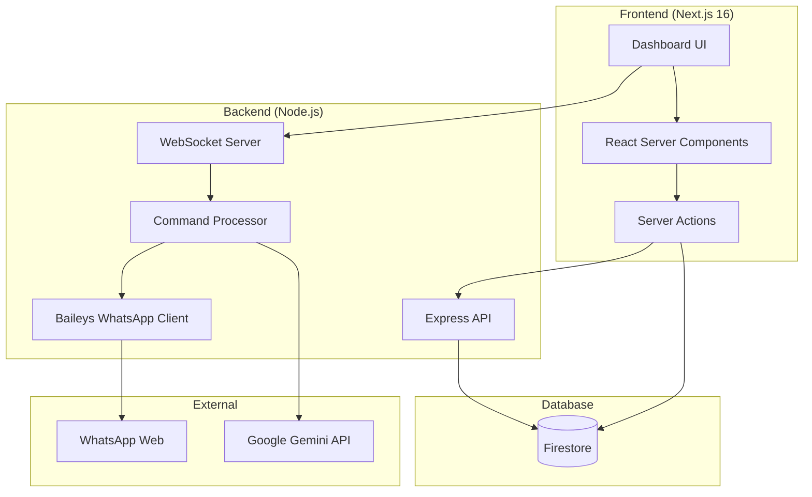

# WhatsDeX Architecture

> **Version**: 2.0.0
> **Last Updated**: 2026-01-15

## 1. System Overview

WhatsDeX is a modern WhatsApp bot management dashboard and automation platform. It consists of a decoupled architecture with a distinct Frontend and Backend, communicating via RESTful APIs and WebSockets.

### High-Level Components



- **Frontend**: Next.js 16.1, React 19, TypeScript 5.9. Server-first rendering with App Router.
- **Backend**: Node.js, Express, Baileys. Handles WhatsApp connectivity and automation.
- **Database**: Firebase (Firestore) with subcollection multi-tenancy pattern.
- **External**: WhatsApp Web API (via Baileys), Google Gemini (AI features).

---

## 2. Directory Structure

The project follows a monorepo-style structure:

```
WhatsDeX/
├── backend/                # Node.js Express Server
│   └── src/
│       ├── commands/       # Bot commands
│       ├── config/         # Environment configuration
│       ├── controllers/    # API Controllers
│       ├── services/       # Business Logic
│       ├── routes/         # Express Routes
│       ├── middleware/     # Express Middleware
│       ├── lib/            # Shared libraries
│       └── utils/          # Shared utilities
│
├── frontend/               # Next.js 16 Application
│   ├── src/
│   │   ├── app/            # Routing layer (App Router)
│   │   ├── features/       # Business domains (FSD)
│   │   ├── components/     # Shared UI components
│   │   ├── lib/            # Infrastructure
│   │   ├── server/         # Server-side logic (DAL)
│   │   ├── stores/         # Client state (Zustand)
│   │   └── types/          # TypeScript types
│   └── ARCHITECTURE.md     # Detailed frontend docs
│
└── docs/                   # Documentation
```

---

## 3. Frontend Architecture

> **📄 Detailed Documentation**: [frontend/ARCHITECTURE.md](file:///w:/CodeDeX/WhatsDeX/frontend/ARCHITECTURE.md)

### Technology Stack

| Technology    | Version | Purpose                           |
| ------------- | ------- | --------------------------------- |
| Next.js       | 16.1.2  | App Router, RSC, Server Actions   |
| React         | 19.2.3  | Server Components, React Compiler |
| Tailwind CSS  | 4.1.18  | CSS-first design system           |
| TypeScript    | 5.9.3   | Static type checking              |
| Framer Motion | 12.26.2 | GPU-accelerated animations        |
| Zustand       | 5.0.10  | Client-side state                 |
| Zod           | 4.3.5   | Runtime validation                |
| Firebase      | 12.8.0  | Firestore, Authentication         |

### Key Patterns

1. **Hybrid Feature-Sliced Design**: Business logic organized by domain in `features/`
2. **Server-First**: RSC by default, Client Components only for interactivity
3. **Thin Page Pattern**: `app/` routes import from `features/`
4. **Atomic UI**: Pure, stateless components in `components/ui/`
5. **Data Access Layer**: Server-side operations in `server/dal/`

---

## 4. Backend Architecture

### Layers

1. **Interface Layer** (`src/controllers`, `src/routes`)
   - Responsibility: HTTP requests/responses, input validation.
   - Rule: Thin controllers; delegate logic to Services.

2. **Business Logic Layer** (`src/services`)
   - Responsibility: Core application logic, external API calls.
   - Rule: Framework agnostic (no Express `req`/`res`).

3. **Data Layer** (`src/models`, Firestore)
   - Responsibility: Data definitions and schemas.

### Key Components

- **Baileys Handler**: Manages WhatsApp socket connection.
- **Command Processor**: Parses and executes message commands.
- **Multi-Tenant Router**: Routes requests based on tenant context.

---

## 5. Data Architecture

### Multi-Tenancy Pattern

All data follows the **subcollection pattern**:

```
tenants/{tenantId}/
├── users/{userId}
├── bots/{botId}
├── messages/{messageId}
└── settings/{settingId}
```

### Security Rules

```javascript
match /tenants/{tenantId}/{document=**} {
  allow read, write: if request.auth.token.tenantId == tenantId;
}
```

---

## 6. Coding Standards

### TypeScript

- **Strict mode enabled** in both frontend and backend
- **No `any` type** - use `unknown` with type narrowing
- **Explicit return types** on all exported functions

### Testing

- **Unit Tests**: Co-located with source files (`*.test.ts`)
- **Integration Tests**: `__tests__/` directories
- **Commands**: `npm run typecheck`, `npm run test:run`

### Configuration

#### Configuration Hierarchy

WhatsDeX uses a **layered configuration system** that separates infrastructure from tenant settings:

| Layer | Location | Controlled By | Examples |
|-------|----------|---------------|----------|
| **Infrastructure** | `.env` | Platform Operator | JWT_SECRET, REDIS_URL, STRIPE_KEY |
| **Platform Defaults** | `ConfigManager.ts` | Code | Rate limits, feature flags |
| **Tenant Settings** | Firestore | End-user (Dashboard) | ownerNumber, botDefaults |
| **Bot Configuration** | Firestore | End-user (Dashboard) | prefix, mode, aiEnabled |

> **Rule**: End-users NEVER have access to infrastructure configuration.
> All user-configurable settings live in Firestore via `TenantConfigService`.

- All secrets via environment variables
- `.env.example` templates in each package

### Error Handling

- **Backend**: Centralized error middleware
- **Frontend**: Error boundaries + Result Pattern

### Linting

- ESLint + Prettier must pass before commit
- Husky pre-commit hooks enforce standards

---

## 7. Development Workflow

- **Branching**: Feature branches → Pull Request → Main
- **Commit Messages**: Conventional Commits (feat, fix, chore)
- **Code Review**: Required for all PRs
- **CI/CD**: Automated typecheck, lint, test, build

---

## 8. Performance

### Frontend

- **Turbopack**: Default bundler in Next.js 16
- **React Compiler**: Automatic memoization
- **PPR**: Partial Prerendering for mixed content
- **Image Optimization**: `next/image` for all images

### Backend

- **Caching**: Redis for expensive operations
- **Rate Limiting**: Per-tenant rate limits
- **Connection Pooling**: Reuse WhatsApp connections
