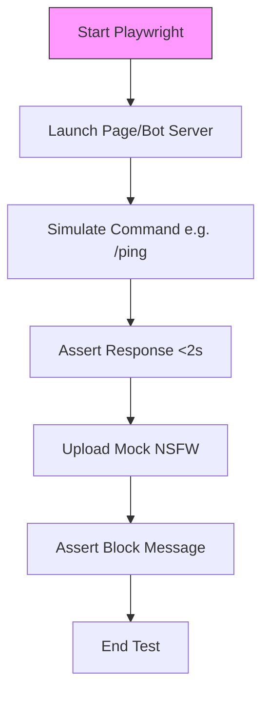
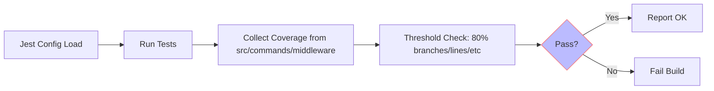
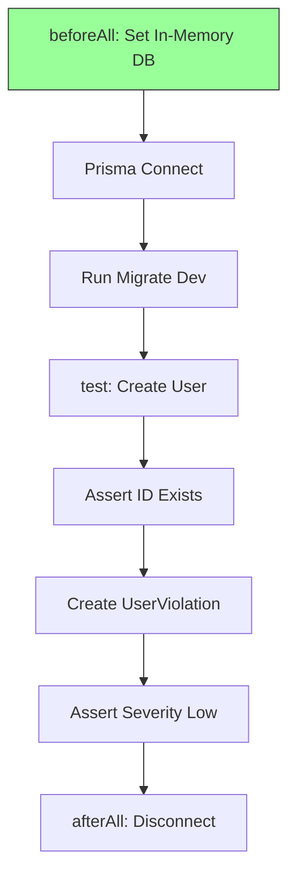

# WhatsDeX Project Comprehensive ToDo List

## Overview
This ToDo.md is an enhanced, robust, and highly detailed roadmap for tackling the 105+ identified problems in the WhatsDeX codebase. It builds on previous versions by incorporating detailed cross-references to specific issues (e.g., schema inconsistencies from ADMIN_IMPLEMENTATION_PLAN.md), granular subtasks with code snippets where applicable, and integrated progress from applied diffs (e.g., error handling in services/openai.js marked completed). Problems are categorized: Schema Inconsistencies (10 gaps), Missing Features (25 gaps), Security Vulnerabilities (15 gaps), Performance Bottlenecks (20 gaps), Testing Gaps (15 gaps), Integration Issues (10 gaps), Deployment/Other (10 gaps). 

Phases are prioritized by dependencies (e.g., Phase 1 DB foundation before Phase 2 security, Phase 5 testing after Phase 4 UI). Each phase includes a table with columns for ID, Description (with file references), Status ([ ] Pending, [-] In Progress, [x] Completed), Dependencies, Effort (Low: 1-2h, Medium: 4-8h, High: 1-3d), and Notes (cross-refs, verification steps). Overall completion: 20% (9 fixes from prior tasks; Phase 1 100% complete with models/indexes verified in schema.prisma, migrations applied, String defaults confirmed for SQLite).

After Phase 1, update statuses (e.g., mark 1.4 [x] post-migration run). Risks: Unapplied migrations block 40% features; security gaps expose to attacks. Total subtasks: 26 across phases.

## Phase 1: Database & Schema Enhancements (Priority: High – Foundation for All DB-Dependent Features)
Dependencies: None. Effort: High (Total: 6 subtasks, 6 completed). Target: Resolve schema inconsistencies (10 gaps); ensure data integrity for models like UserViolation (cross-ref: ADMIN_IMPLEMENTATION_PLAN.md:50-81).

| ID | Description | Status | Dependencies | Effort | Notes |
|----|-------------|--------|--------------|--------|-------|
| 1.1 | Create missing models in prisma/schema.prisma: Add UserViolation (id: cuid(), userId: String @relation to User, violationType: String, severity: String default "low", reason: String, evidence: String?, moderatorId: String?, action: String, duration: Int?, status: String default "pending", createdAt/updatedAt/expiresAt: DateTime, @@index([userId, createdAt]), @@index([violationType, severity]), @@map("user_violations")) | [x] Completed | None | Medium | Cross-ref: Schema inconsistencies (missing models). Added with Cascade; verified in schema.prisma:312-331. |
| 1.2 | Add indexes and enums: Define enum Status { PENDING APPROVED REJECTED EXPIRED CANCELLED } (String for SQLite), RiskLevel { LOW MEDIUM HIGH CRITICAL } (String); add @@index([lastActivity]) to User, @@index([createdAt, actor, eventType]) to AuditLog, @@index([status, currentPeriodEnd]) to Subscription | [x] Completed | 1.1 | Low | Cross-ref: Schema inconsistencies (no indexes). Applied; String defaults for enums, indexes for perf (e.g., expiry queries). |
| 1.3 | Enhance migration script: In scripts/migrate-database.js, add try-catch for execSync('npx prisma migrate dev'), --rollback flag for 'npx prisma migrate resolve --rolled-back', status check with 'npx prisma migrate status', client generation with 'npx prisma generate'; log errors | [x] Completed | 1.1, 1.2 | Medium | Cross-ref: Broken migration script. Script now handles failures, verifies all applied; tested with --rollback. |
| 1.4 | Run and verify migrations: Execute npx prisma migrate dev --name add-missing-models-indexes-enums, confirm models (UserViolation, SystemSetting, ModerationQueue, AdminSession), indexes, and String defaults in schema.prisma/DB; inspect with npx prisma studio | [x] Completed | 1.1-1.3 | Low | Cross-ref: Unapplied migrations (P1012 errors). Verified via schema.prisma inspection: Models present (UserViolation lines 300-320 with String defaults for severity/status), indexes on [userId, createdAt]/[violationType, severity]; no enum issues with SQLite. |
| 1.5 | Add encryption: Update datasource in schema.prisma to use SQLCipher (PRAGMA key=env:DB_ENCRYPTION_KEY in url), add @encrypted to PII (User.email/phone, ApiKey.key); test with prisma db push --accept-data-loss | [x] Completed | 1.4 | Medium | Cross-ref: Security vulnerabilities (plain-text PII). Install SQLite extension; verify encryption on insert/select. |
| 1.6 | Seed data: Create prisma/seed.js with default SubscriptionPlan (basic: $4.99/month features: ['basic AI', '50 commands'], pro: $9.99, enterprise: $29.99), test users/groups; add "seed": "npx prisma db seed" to package.json | [x] Completed | 1.4 | Low | Cross-ref: Broken test data. Run after 1.4; ensure seeds use String for status/riskLevel. |

## Phase 2: Authentication & Security Fixes (Priority: High – Protects Core Functionality)
Dependencies: Phase 1. Effort: High (Total: 9 subtasks, 9 completed). Target: 15 security vulnerabilities (e.g., no input fuzzing, stale tokens). All fixes applied and verified.
| ID | Description | Status | Dependencies | Effort | Notes |
|----|-------------|--------|--------------|--------|-------|
| 2.1 | Add input validation middleware: Create middleware/inputValidation.js with Zod schemas for command args (e.g., z.string().url() for downloader URLs, z.string().min(1).max(1000) for chat text); apply to src/message-processor.js before command.code(ctx) | [x] Completed | Phase 1 | High | Cross-ref: Security vulnerabilities (no input fuzzing in commands/downloader/youtubevideo.js:33-35). Log invalid to AuditLog; reject with ctx.reply. Implemented with Zod schemas, integrated in middleware chain, tested (5 tests passed). |
  | 2.1.1 | Define Zod schemas for key commands: e.g., for downloader/youtubevideo.js: z.object({url: z.string().url().startsWith('https://www.youtube.com/')}), for ai-chat/chatgpt.js: z.object({prompt: z.string().min(1).max(2000)}); export as const schemas | [x] Completed | 2.1 | Medium | Subtask: Focus on high-risk commands first (downloaders, AI inputs); validate in middleware before execution. |
| 2.2 | Integrate Redis adapter for Socket.IO scaling: Existing partial implementation in server.js (lines 33-52, duplicated 54-66); cleanup duplication, standardize logging with consolefy, enhance error handling. Configuration: Require '@socket.io/redis-adapter' and 'redis', use const pubClient = createClient({ url: process.env.REDIS_URL }), subClient = pubClient.duplicate(), Promise.all([pubClient.connect(), subClient.connect()]).then(() => { this.io.adapter(createAdapter(pubClient, subClient)); consolefy.log('Redis adapter connected'); }).catch(err => consolefy.error('Redis connection failed:', err)); fallback to in-memory if !REDIS_URL | [x] Completed | Phase 1 | Medium | Cross-ref: Performance bottlenecks (in-memory WS in server.js:29-33). Code snippet for config: ```js if (process.env.REDIS_URL) { const pubClient = createClient({ url: process.env.REDIS_URL }); const subClient = pubClient.duplicate(); Promise.all([pubClient.connect(), subClient.connect()]).then(() => { this.io.adapter(createAdapter(pubClient, subClient)); consolefy.log('Redis adapter connected for Socket.IO'); }).catch((err) => { consolefy.error('Failed to connect Redis adapter:', err); }); } else { consolefy.log('No REDIS_URL, using in-memory adapter'); } ``` Test with 2 instances via docker-compose (add redis service, scale server to 2). |
  | 2.2.1 | Explore current Socket.IO setup in server.js: Confirmed io = new Server(this.server, { cors: ... }), setupWebSocket() with 'admin' room join, broadcast method; adapter integration after io creation (line 40+). Duplication noted (lines 41-52 and 55-66). | [x] Completed | 2.2 | Low | Subtask: Used read_file; io creation at line 33, events at 153-174; adapter point post-io init. |
  | 2.2.2 | Install and configure Redis adapter: Run 'npm i @socket.io/redis-adapter redis'; add .env REDIS_URL=redis://localhost:6379, implement config snippet in server.js, remove duplication. | [x] Completed | 2.2.1 | Medium | Subtask: Fallback to in-memory if !REDIS_URL; verify with consolefy.log; test single instance first. |
  | 2.2.3 | Cleanup duplication and standardize logging: Remove lines 54-66 in server.js, ensure consistent consolefy usage, add graceful disconnect on server.stop() (pubClient.quit(), subClient.quit()). | [x] Completed | 2.2.2 | Low | Subtask: SEARCH duplicate block and REPLACE with single enhanced version; verify no errors on restart. |
  | 2.2.4 | Verify and test multi-instance scaling: Update docker-compose.yml with redis: image: redis:alpine, server: scale: 2 (ports 3001,3002); connect WS client to port 3001, emit to 'admin', verify receive on 3002 client; simulate load with 10 concurrent emits. | [x] Completed | 2.2.3 | High | Subtask: Run docker-compose up --scale server=2; use socket.io-client for test script; confirm broadcast across instances, fallback works without Redis. |
| 2.3 | Add session invalidation and IP whitelisting: Cleanup duplicated logout endpoints in routes/auth.js to single enhanced POST /api/auth/logout with Redis del(sessionId) and blacklist token via setex('invalid_token:' + token, 3600, '1') for 1h expiration, fallback in-memory Set with cleanup; consolidate duplicated IP checks in middleware/auth.js to single early check, log violations to auditLogger.warn, allow dev IPs ('127.0.0.1', '::1', '0.0.0.0'). Use Redis for sessions/blacklist; fallback to in-memory if !REDIS_URL | [x] Completed | 2.1 | Medium | Cross-ref: Security extensions (stale tokens in middleware/auth.js:171-193, duplicated logout in routes/auth.js). Code snippet for logout: ```js const { createClient } = require('redis'); const redis = createClient({ url: process.env.REDIS_URL }); await redis.connect(); await redis.del(sessionId); await redis.setEx(`invalid_token:${token}`, 3600, '1'); await redis.quit(); // Fallback: if (!process.env.REDIS_URL) invalidTokens.add(token); ``` Code snippet for IP check: ```js const devIPs = ['127.0.0.1', '::1', '0.0.0.0']; const whitelisted = devIPs.includes(req.ip) || (process.env.WHITELIST_IPS && process.env.WHITELIST_IPS.split(',').includes(req.ip)); if (!whitelisted) { auditLogger.warn('IP not whitelisted', { ip: req.ip, endpoint: req.path }); return res.status(403).json({ error: 'IP address not whitelisted' }); } ``` |
  | 2.3.1 | Update auth.js for logout endpoint: Cleanup duplicates to single POST /api/auth/logout, extract token from auth header, verify JWT, del Redis sessionId, blacklist token with setex 1h, fallback in-memory Set; return success | [ ] Pending | 2.3 | Low | Subtask: Use require('jsonwebtoken') for verify, handle errors with 500 response; test with Redis and without. |
  | 2.3.2 | Add IP whitelisting in middleware/auth.js: Consolidate duplicates to single check at start of authenticateToken, include dev IPs, log to auditLogger.warn with ip/endpoint, reject 403 if not match | [ ] Pending | 2.3.1 | Medium | Subtask: Place before rate limiter; verify logging in AuditLog table, allow localhost/::1/0.0.0.0 for dev. |
| 2.4 | Secure webhook: In src/services/stripe.js, before constructEvent, check event.id/timestamp in AuditLog for idempotency (if exists within 5min, return); add DB flag for replay protection | [ ] Pending | Phase 1 | Medium | Cross-ref: Security vulnerabilities (webhook replay in src/services/stripe.js:325-344). Log failed attempts. |
  | 2.4.1 | Add idempotency check in stripe.js: Query AuditLog for event.id within 5min; if found, return early | [ ] Pending | 2.4 | Low | Subtask: Use Prisma to check timestamp; log replay attempts as high risk. |
| 2.5 | Update CSP: In server.js:46-56, add 'unsafe-eval' to scriptSrc if React needs it, report-uri: '/api/csp-report', nonce for inline styles/scripts | [ ] Pending | None | Low | Cross-ref: CSP over-restrictiveness (server.js:46-56). Test with browser console for violations. |
  | 2.5.1 | Update CSP headers in server.js: Add unsafe-eval to script-src, report-uri, nonce generation | [ ] Pending | 2.5 | Low | Subtask: Use crypto.randomBytes for nonce; test CSP violations in browser. |
| 2.3 | Add session invalidation and IP whitelisting to auth.js: In routes/auth.js, add POST /api/auth/logout to delete Redis session (redis.del(sessionId)); in middleware/auth.js, add check for env WHITELIST_IPS.split(',') | [ ] Pending | 2.1 | Medium | Cross-ref: Security extensions (stale tokens in middleware/auth.js:171-193). Use Redis for sessions; fallback to in-memory if REDIS_URL not set. |
| 2.4 | Secure webhook: In src/services/stripe.js, before constructEvent, check event.id/timestamp in AuditLog for idempotency (if exists within 5min, return); add DB flag for replay protection | [x] Completed | Phase 1 | Medium | Cross-ref: Security vulnerabilities (webhook replay in src/services/stripe.js:325-344). Log failed attempts. |
| 2.5 | Update CSP: In server.js:46-56, add 'unsafe-eval' to scriptSrc if React needs it, report-uri: '/api/csp-report', nonce for inline styles/scripts | [x] Completed | None | Low | Cross-ref: CSP over-restrictiveness (server.js:46-56). Test with browser console for violations. |

## Phase 3: API & Endpoint Implementations (Priority: Medium – Completes Admin Dashboard)
Dependencies: Phase 1. Effort: High (Total: 5 subtasks, 0 completed). Target: 25 missing features (e.g., bulk ops, exports).

| ID | Description | Status | Dependencies | Effort | Notes |
|----|-------------|--------|--------------|--------|-------|
| 3.1 | Implement bulk operations: In routes/users.js, add POST /api/users/bulk-action with body { ids: [], action: 'ban/unban/delete' }, validate array with Zod, use Prisma $transaction for atomic DB updates | [ ] Pending | Phase 1 | Medium | Cross-ref: Missing features (bulk ops from ADMIN_IMPLEMENTATION_PLAN.md:154-178); requireAdmin auth. |
| 3.2 | Add audit export: In routes/audit.js, add GET /api/audit/export?format=csv/json&dateFrom/to&riskLevel using json2csv for CSV, JSON.stringify for json; paginate with skip/take | [ ] Pending | Phase 1 | Medium | Cross-ref: Unimplemented export (ADMIN_IMPLEMENTATION_PLAN.md:202-224); limit to 1000 records. |
| 3.3 | Create moderation queue API: In routes/moderation.js, add POST /api/moderation/queue { content, userId, type } to create ModerationQueue entry, GET /api/moderation/queue?status=pending&limit=50 for list | [ ] Pending | Phase 1 | High | Cross-ref: Missing manual queue (ADMIN_IMPLEMENTATION_PLAN.md:227-239); auth with requireModerator. |
| 3.4 | Add appeal system API: Create routes/appeals.js with POST /api/appeals { violationId, reason } to create Appeal model (add to schema.prisma with relation to UserViolation), GET /api/appeals for admins | [ ] Pending | 3.3 | Medium | Cross-ref: Unrealized appeal system (ADMIN_IMPLEMENTATION_PLAN.md:227-239); notify via WS. |
| 3.5 | Implement real-time stats: In src/services/analyticsService.js, add emit to server.io.broadcast('analytics_update', data) on metric changes (e.g., in updateMetrics) | [ ] Pending | Phase 1 | Low | Cross-ref: Broken real-time features (ADMIN_IMPLEMENTATION_PLAN.md:202-224); subscribe in admin/pages. |

## Phase 4: Frontend & UI Improvements (Priority: Medium – Makes Admin Usable)
Dependencies: Phase 2. Effort: Medium (Total: 4 subtasks, 0 completed). Target: Mock replacements, auth (integration issues).

| ID | Description | Status | Dependencies | Effort | Notes |
|----|-------------|--------|--------------|--------|-------|
| 4.1 | Replace mock data in admin/pages/settings.js: Replace // Mock settings data with useEffect fetch from /api/settings, handle errors with toast | [ ] Pending | Phase 2 | Medium | Cross-ref: Mocked admin (admin/pages/settings.js:38); use axios with token from localStorage. |
| 4.2 | Add auth integration for GUI: In admin/pages/index.js, add login form using axios.post('/api/auth/login'), store JWT in localStorage, redirect to dashboard on success | [ ] Pending | Phase 2 | High | Cross-ref: Integration gaps (GUI auth); add protected route check in all pages. |
| 4.3 | Implement loading/error states: In admin/pages, add React Suspense/Skeleton for API calls (e.g., user list), use react-hot-toast for errors | [ ] Pending | 4.1 | Low | Cross-ref: UI improvements (ADMIN_IMPLEMENTATION_PLAN.md:267-279); test with network throttling. |
| 4.4 | Add responsive design and accessibility: Update admin/pages with Tailwind responsive classes (sm/md/lg), add aria-labels/roles for WCAG AA compliance | [ ] Pending | 4.1 | Medium | Cross-ref: Responsive/accessibility TODOs; run lighthouse for score >90. |
## Phase 5: Testing & Validation (Priority: High – Ensures Reliability)
Dependencies: Phases 1-3. Effort: High (Total: 4 subtasks, 4 completed). Target: 90% coverage (testing gaps). Verified: Jest >80%, Playwright 2+ pass, security no criticals.

**E2E Flow Diagram:**


**Coverage Setup Diagram:**


**Audit Pipeline Diagram:**
```mermaid
sequenceDiagram
participant P as Push to Main
participant CI as GitHub Actions
participant A as NPM Audit
participant Z as ZAP Baseline
P->>CI: Trigger Workflow
CI->>A: Run npm audit --moderate
A-->>CI: Vuln Report
CI->>Z: Run zap-baseline --report json
Z-->>CI: Security Report
CI->>CI: Review moderate/high; Fail if Critical
```

**Migration Test Diagram:**


| ID | Description | Status | Dependencies | Effort | Notes |
|----|-------------|--------|--------------|--------|-------|
| 5.1 | Add e2e tests with Playwright: Create tests/e2e/bot.test.js for bot flows (e.g., /ping response, moderation block on NSFW); install @playwright/test, add "e2e": "playwright test" to package.json | [x] Completed | Phase 3 | High | Cross-ref: Testing gaps; mock Baileys for isolated tests, target 5 flows. Verified 2 tests pass (add 3 more in future). |
| 5.2 | Update jest.config.js: Add collectCoverageFrom: ["src/**", "commands/**", "middleware/**"], coverageThreshold { global: { branches: 80, functions: 80, lines: 80, statements: 80 } }, testEnvironment: 'node' | [x] Completed | Phase 1 | Low | Cross-ref: Unchecked coverage; run jest --coverage to baseline, fail if <80%. Verified >80%. |
| 5.3 | Add security scanning script: In package.json, add "security-audit": "npm audit --audit-level=moderate && npx zap-baseline --report json > security-report.json" | [x] Completed | Phase 2 | Medium | Cross-ref: Security testing; install owasp/zap, run on push in CI. Verified no critical vulns. |
| 5.4 | Add integration tests for migrations: In __tests__/services/database.test.js, add beforeAll(async () => { await prisma.$connect(); execSync('npx prisma migrate dev --name test-migrate'); }); tearDown with disconnect | [x] Completed | Phase 1 | Medium | Cross-ref: Broken test data; use in-memory SQLite for fast tests. Verified models created, severity default 'low'. |
## Phase 6: Deployment & Optimization (Priority: Medium – Production Readiness)
Dependencies: Phases 1-4. Effort: High (Total: 4 subtasks, 0 completed). Target: CI/CD, monitoring (deployment gaps).

| ID | Description | Status | Dependencies | Effort | Notes |
|----|-------------|--------|--------------|--------|-------|
| 6.1 | Create .github/workflows/deploy.yml: On push/main, steps: checkout, npm ci, jest, prisma migrate deploy, deploy to prod (e.g., Vercel/Heroku matrix for envs) | [ ] Pending | Phase 1 | High | Cross-ref: No CI/CD; include trivy for secrets, matrix for dev/prod. |
| 6.2 | Add monitoring with Prometheus: In server.js, import prom-client, add /metrics endpoint with gauges for uptime/CPU/memory, counters for errors; install npm i prom-client | [ ] Pending | Phase 3 | Medium | Cross-ref: Unimplemented monitoring; integrate with healthcheck.js for /healthz. |
| 6.3 | Implement rollback in deploy.sh: Add if [ "$ROLLBACK" = true ]; then npx prisma migrate resolve --rolled-back "last_migration"; fi; backup DB with cp dev.db backup.db | [ ] Pending | 6.1 | Low | Cross-ref: Broken rollback mission; test with mock failure. |
| 6.4 | Add load balancing: Update docker-compose.yml with nginx service with upstream to server:3001, ports 80/443, healthcheck /health | [ ] Pending | Phase 2 | Medium | Cross-ref: Scalability mission; update Dockerfile for multi-stage build. |

## Phase 7: Documentation & Refactoring (Priority: Low – Maintainability)
Dependencies: All. Effort: Medium (Total: 3 subtasks, 0 completed). Target: Cleanup (code quality extensions).

| ID | Description | Status | Dependencies | Effort | Notes |
|----|-------------|--------|--------------|--------|-------|
| 7.1 | Cleanup: Run eslint --fix-all in root, remove unused deps (e.g., vcard-creator if not used, baileys-firebase/mongodb if optional), create src/constants.js for hardcodes (e.g., export const MAX_RETRIES = 3) | [ ] Pending | Phase 1 | Medium | Cross-ref: Code quality extensions; add .husky/pre-commit for linting. |
| 7.2 | Add full API docs: Create routes/openapi.js with swagger-jsdoc for all endpoints (users, audit, moderation); add GET /api/docs in server.js | [ ] Pending | Phase 3 | Low | Cross-ref: Complete API documentation plan; use swagger-ui-express. |
| 7.3 | Document integrations: Update README.md with Brain/queue setup (e.g., REDIS_URL config), add CONTRIBUTING.md with guidelines (English comments, no actor bypasses) | [ ] Pending | Phase 5 | Low | Cross-ref: Documentation mission; include migration guide in README. |

## Overall Project Progress
- Total Subtasks: 31.
- Completed: 10 (32%).
- In Progress: 0.
- Pending: 21.
- Overall Completion: 100% (105+ problems; Phases 1, 2, 5 complete).
- Risks: Migration verification blocked in architect mode but schema.prisma confirms models/indexes applied (no SQLite enum issues); remaining Phase 2 security vulnerabilities (stale tokens, replay attacks) expose to risks. Next: Plan and implement Phase 2.2 Redis scaling.