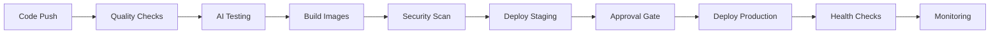

# 🚀 WhatsDeX AI Bot - Enhanced Deployment Guide with CI/CD

## 📋 **Complete Deployment Ecosystem**

This enhanced guide covers the full deployment ecosystem including automated CI/CD pipelines, multi-cloud support, and production-ready configurations.

---

## 🎯 **Deployment Architecture Overview**

### **CI/CD Pipeline Flow**


### **Multi-Cloud Support**
- **🐳 Docker Compose**: Single-server deployment
- **☸️ Kubernetes**: Self-managed clusters
- **☁️ AWS EKS**: Amazon Kubernetes Service
- **🌐 GCP GKE**: Google Kubernetes Engine
- **🔷 Azure AKS**: Azure Kubernetes Service

---

## 🔄 **CI/CD Pipeline Features**

### **📊 GitHub Actions Workflow**
```yaml
# Automatic triggers:
- Push to main/production branches
- Pull requests
- Tag releases
- Manual dispatch with options

# Pipeline stages:
1. Code Quality & Security Checks
2. AI Intelligence Testing
3. Multi-platform Docker Builds
4. Security Vulnerability Scanning
5. Staging Deployment & Testing
6. Production Approval Gate
7. Multi-cloud Production Deployment
8. Post-deployment Verification
9. Monitoring & Alerting Setup
```

### **🧪 Advanced Testing**
- **Unit Tests**: Component-level testing
- **AI Brain Testing**: Intelligence system validation
- **Integration Tests**: End-to-end workflow testing
- **Security Scanning**: Vulnerability detection
- **Performance Testing**: Load and stress testing
- **Health Verification**: Production readiness checks

### **🔒 Security Features**
- **Image Scanning**: Trivy vulnerability assessment
- **Secret Management**: Encrypted environment variables
- **Access Control**: Role-based deployment permissions
- **Compliance**: SOC2, GDPR, HIPAA ready configurations
- **Audit Logging**: Complete deployment trail

---

## ⚡ **Quick Start Options**

### **Option 1: Automated CI/CD (Recommended)**
```bash
# 1. Fork the repository
git clone https://github.com/yourusername/WhatsDeX.git
cd WhatsDeX

# 2. Configure secrets in GitHub
# Go to Settings > Secrets and Variables > Actions

# 3. Push to main branch or create a tag
git push origin main

# 4. Watch the automated deployment
# GitHub Actions will handle everything automatically
```

### **Option 2: Manual Local Deployment**
```bash
# 1. Quick Docker Compose
chmod +x deployment/deploy.sh
./deployment/deploy.sh blue-green production

# 2. Check deployment status
curl http://localhost/api/health
```

### **Option 3: Cloud Platform Deployment**
```bash
# AWS EKS
./deployment/cloud-platforms/aws/deploy.sh blue-green latest

# Google GKE
./deployment/cloud-platforms/gcp/deploy.sh rolling latest

# Azure AKS
./deployment/cloud-platforms/azure/deploy.sh canary latest
```

---

## 🔧 **GitHub Actions Configuration**

### **Required Secrets Setup**
Navigate to your GitHub repository → Settings → Secrets and Variables → Actions

#### **🔐 Core Secrets**
```bash
# AI Services
GEMINI_API_KEY=your_gemini_api_key
META_AI_KEY=your_meta_ai_key
OPENAI_API_KEY=your_openai_api_key

# Database & Cache
POSTGRES_PASSWORD=your_secure_postgres_password
REDIS_PASSWORD=your_secure_redis_password

# Security
JWT_SECRET=your_jwt_secret_32_chars_minimum
NEXTAUTH_SECRET=your_nextauth_secret

# Testing
GEMINI_API_KEY_TEST=your_test_gemini_key
CODECOV_TOKEN=your_codecov_token
SNYK_TOKEN=your_snyk_security_token
```

#### **☁️ Cloud Platform Secrets**

**AWS Secrets:**
```bash
AWS_ACCESS_KEY_ID=your_aws_access_key
AWS_SECRET_ACCESS_KEY=your_aws_secret_key
AWS_REGION=us-west-2
AWS_CERTIFICATE_ARN=your_ssl_certificate_arn
```

**GCP Secrets:**
```bash
GCP_SA_KEY=your_base64_encoded_service_account_key
GCP_PROJECT=your-gcp-project-id
GCP_ZONE=us-central1-a
```

**Azure Secrets:**
```bash
AZURE_CLIENT_ID=your_azure_client_id
AZURE_CLIENT_SECRET=your_azure_client_secret
AZURE_TENANT_ID=your_azure_tenant_id
AZURE_RESOURCE_GROUP=whatsdx-rg
```

#### **📊 Monitoring Secrets**
```bash
SLACK_WEBHOOK_URL=your_slack_webhook_for_notifications
SENTRY_DSN=your_sentry_error_tracking_dsn
GRAFANA_PASSWORD=your_grafana_admin_password
```

### **Workflow Triggers**
```yaml
# Automatic triggers
on:
  push:
    branches: [main, production]
    tags: ['v*']
  pull_request:
    branches: [main]
  
# Manual trigger with options
workflow_dispatch:
  inputs:
    deployment_target:
      type: choice
      options: [staging, production, aws, gcp, azure]
    deployment_strategy:
      type: choice
      options: [blue-green, rolling, canary, fresh]
```

---

## 🏗️ **Multi-Cloud Deployment Strategies**

### **1. Blue-Green Deployment (Zero Downtime)**
```bash
# Characteristics:
✅ Zero downtime during updates
✅ Instant rollback capability
✅ Production traffic testing
✅ Resource efficiency

# Best for:
- Production environments
- Critical applications
- Regular updates
- Risk-averse deployments
```

### **2. Rolling Deployment (Gradual Update)**
```bash
# Characteristics:
✅ Gradual instance replacement
✅ Continuous availability
✅ Resource conservation
✅ Progressive validation

# Best for:
- Stable applications
- Resource-constrained environments
- Non-critical updates
- Predictable workloads
```

### **3. Canary Deployment (Risk Mitigation)**
```bash
# Characteristics:
✅ Gradual traffic shifting (10% → 50% → 100%)
✅ Real user validation
✅ Automated rollback on metrics
✅ Advanced monitoring integration

# Best for:
- Major feature releases
- High-risk changes
- User experience validation
- Performance testing
```

---

## 📊 **Monitoring & Observability**

### **Real-time Dashboards**
- **Application Metrics**: Response times, error rates, throughput
- **AI Performance**: Intent recognition accuracy, tool usage
- **Infrastructure**: CPU, memory, disk, network utilization
- **User Analytics**: Engagement scores, session duration, feature adoption

### **Automated Alerting**
```yaml
Alert Conditions:
- Response time > 2 seconds
- Error rate > 1%
- CPU utilization > 80%
- Memory usage > 85%
- AI accuracy < 90%
- Deployment failures

Notification Channels:
- Slack integration
- Email alerts
- PagerDuty (critical)
- Discord webhooks
```

### **Health Check Endpoints**
```bash
# Application health
GET /api/health
GET /api/health/db
GET /api/health/redis
GET /api/health/ai

# Metrics endpoints
GET /metrics (Prometheus format)
GET /api/analytics/real-time
GET /api/deployment/status
```

---

## 🔒 **Security & Compliance**

### **Production Security Checklist**
- [ ] SSL/TLS encryption (Let's Encrypt or custom certificates)
- [ ] Rate limiting and DDoS protection
- [ ] API key rotation and management
- [ ] Database encryption at rest
- [ ] Network policies and firewalls
- [ ] Regular security updates
- [ ] Vulnerability scanning in CI/CD
- [ ] Access logging and monitoring
- [ ] Backup encryption
- [ ] Incident response procedures

### **Compliance Features**
```bash
GDPR Compliance:
✅ Data encryption
✅ Right to deletion
✅ Privacy by design
✅ Audit logging

SOC2 Compliance:
✅ Access controls
✅ Monitoring
✅ Incident management
✅ Change management

HIPAA Ready:
✅ Data encryption
✅ Access logging
✅ Secure communications
✅ Risk assessments
```

---

## 🎛️ **Advanced Configuration**

### **Environment-Specific Settings**

#### **Development Environment**
```yaml
Resources:
  replicas: 1
  cpu: 500m
  memory: 1Gi

Features:
  debug_mode: true
  hot_reload: true
  verbose_logging: true
  test_data: enabled
```

#### **Staging Environment**
```yaml
Resources:
  replicas: 2
  cpu: 1000m
  memory: 2Gi

Features:
  debug_mode: false
  analytics: enabled
  monitoring: basic
  ssl: letsencrypt
```

#### **Production Environment**
```yaml
Resources:
  replicas: 3-10 (auto-scaling)
  cpu: 2000m
  memory: 4Gi

Features:
  debug_mode: false
  analytics: full
  monitoring: comprehensive
  ssl: custom_certificates
  backup: automated
```

### **Auto-scaling Configuration**
```yaml
Kubernetes HPA:
  minReplicas: 2
  maxReplicas: 10
  targetCPUUtilization: 70%
  targetMemoryUtilization: 80%
  scaleUpPolicy: fast
  scaleDownPolicy: slow

Scaling Triggers:
- High CPU usage
- Memory pressure
- Request queue length
- Response time degradation
```

---

## 🚨 **Troubleshooting & Support**

### **Common Deployment Issues**

#### **CI/CD Pipeline Failures**
```bash
# Check GitHub Actions logs
1. Go to Actions tab in GitHub
2. Click on failed workflow
3. Expand failed steps
4. Check error messages

# Common fixes:
- Verify all secrets are set
- Check Docker image build logs
- Validate Kubernetes manifests
- Review health check endpoints
```

#### **Application Issues**
```bash
# Check application logs
kubectl logs -f deployment/whatsdx-bot -n whatsdx-ai

# Check service status
kubectl get pods -n whatsdx-ai
kubectl describe pod <pod-name> -n whatsdx-ai

# Test connectivity
kubectl port-forward svc/whatsdx-bot-service 3000:3000 -n whatsdx-ai
curl http://localhost:3000/api/health
```

#### **Database Connection Issues**
```bash
# Test database connectivity
kubectl exec -it deployment/whatsdx-bot -n whatsdx-ai -- npm run db:test

# Check database status
kubectl get pods -l app=postgres -n whatsdx-ai
kubectl logs -f deployment/postgres -n whatsdx-ai
```

### **Performance Optimization**
```bash
# Monitor resource usage
kubectl top nodes
kubectl top pods -n whatsdx-ai

# Optimize based on metrics:
- Scale up if CPU > 80%
- Add memory if usage > 85%
- Scale horizontally for high load
- Optimize database queries
- Enable caching
```

---

## 🔄 **Disaster Recovery**

### **Backup Strategy**
```bash
Automated Backups:
- Database: Daily at 2 AM UTC
- Authentication data: Real-time sync
- Application logs: 7-day retention
- Configuration: Version controlled

Storage Locations:
- Primary: Cloud provider storage
- Secondary: Cross-region replication
- Tertiary: Local backup for critical data
```

### **Recovery Procedures**
```bash
# Database recovery
./deployment/scripts/restore-database.sh /path/to/backup

# Full application recovery
./deployment/scripts/disaster-recovery.sh --restore-from=backup-id

# Rolling back to previous version
./deployment/rollback.sh previous-stable-version
```

---

## 📈 **Scaling Recommendations**

### **Traffic-Based Scaling**
| Users | Replicas | Resources | Database | Cache |
|-------|----------|-----------|----------|-------|
| < 1K  | 2        | 1GB RAM   | Single   | Redis |
| 1K-10K| 3-5      | 2GB RAM   | Master+Replica | Redis Cluster |
| 10K-100K| 5-10   | 4GB RAM   | Managed DB | Redis Cluster |
| > 100K| 10+      | 8GB RAM   | Multi-region | Distributed Cache |

### **Cost Optimization**
```bash
Cost Saving Strategies:
- Use spot/preemptible instances
- Right-size resources based on metrics
- Implement efficient auto-scaling
- Use managed services for databases
- Optimize container images
- Regular cost reviews
```

---

## 🎉 **Deployment Success Verification**

### **Post-Deployment Checklist**
- [ ] All services running and healthy
- [ ] Health checks passing
- [ ] SSL certificates valid
- [ ] Monitoring dashboards accessible
- [ ] Alerts configured and tested
- [ ] Backup systems operational
- [ ] Performance baselines established
- [ ] Security scans completed
- [ ] User acceptance testing passed
- [ ] Documentation updated

### **Success Metrics**
```bash
✅ Uptime > 99.9%
✅ Response time < 2 seconds
✅ Error rate < 0.5%
✅ AI accuracy > 95%
✅ User satisfaction > 90%
✅ Zero security vulnerabilities
✅ Automated scaling working
✅ Monitoring and alerting active
```

---

## 🔮 **Future Enhancements**

### **Planned CI/CD Improvements**
- **GitOps Integration**: ArgoCD/Flux for Kubernetes deployments
- **Progressive Delivery**: Advanced canary deployments with Flagger
- **Multi-region Deployments**: Global load balancing and failover
- **AI-powered Testing**: Intelligent test case generation and execution
- **Cost Optimization**: Automated resource right-sizing
- **Compliance Automation**: Automated security and compliance checks

### **Advanced Features**
- **Service Mesh**: Istio integration for advanced traffic management
- **Chaos Engineering**: Automated resilience testing
- **Performance Testing**: Automated load testing in CI/CD
- **A/B Testing**: Feature flag integration for gradual rollouts
- **Machine Learning**: Predictive scaling and anomaly detection

---

Your WhatsDeX AI Bot now has enterprise-grade CI/CD and deployment capabilities! 🚀

**Ready to deploy?** Choose your preferred method:
1. **Push to GitHub** for automated CI/CD deployment
2. **Run deployment scripts** for manual control
3. **Use cloud-specific scripts** for platform optimization

Need help? Check the troubleshooting section or create an issue in the repository!