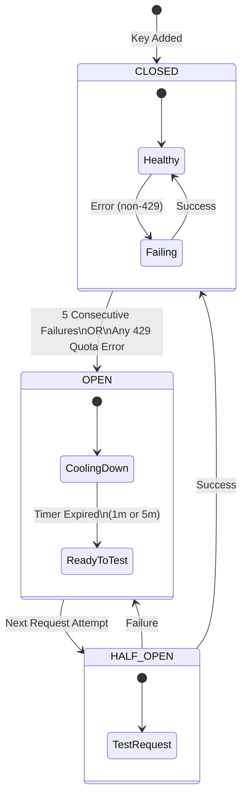
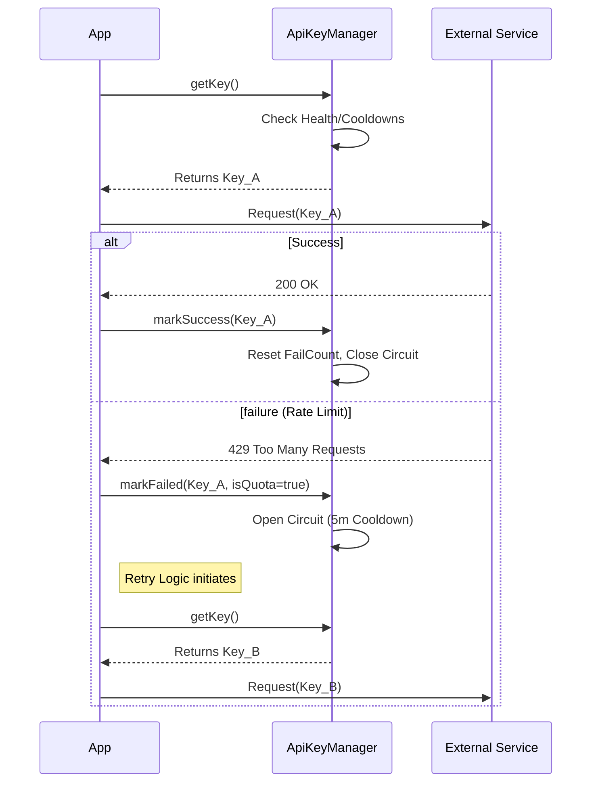

# 🔄 Universal API Key Rotation System

> **A Master Class & Reference Implementation**
>
> *Target Audience: System Architects, Senior Engineers, and AI Agents.*
> *Goal: To establish a fail-proof, maximizing-throughput strategy for consuming rate-limited Third-Party APIs.*

---

## 📑 Table of Contents
1. [System Architecture](#system-architecture)
2. [Visual Workflows (Mermaid Diagrams)](#visual-workflows)
3. [Core Concepts & Theory](#core-concepts--theory)
4. [Reference Implementation (TypeScript)](#reference-implementation)
5. [Integration Guide](#integration-guide)
6. [Instructions for AI Agents](#instructions-for-ai-agents)

---

## 🏗️ System Architecture

The **API Rotation System** is a middleware layer that sits between your application logic and external API providers (like OpenAI, Google Gemini, Anthropic). It transforms a single point of failure (one key) into a resilient, self-healing pool of resources.

### The Problem
- **Rate Limits (429):** APIs impose strict RPM (Requests Per Minute) limits.
- **Quotas:** Daily or monthly limits that disable a key for long periods.
- **Failures:** Transient server errors (500, 503) that require backoff.

### The Solution: "The Hydra Pattern"
Instead of relying on one head (key), we maintain multiple. If one is cut off (rate limited), another immediately takes its place.

```
[ Application ]
       │
       ▼
[ Rotation Manager ] ──┬── [ Key Pool ]
       │               ├── Key A (Healthy)
       │               ├── Key B (Healthy)
       │               └── Key C (Cooling Down)
       ▼
 [ Error Handler ] ◀─── ( 429 / 5xx )
       │
       └── Updates Key State (Circuit Open)
```

---

## 🎨 Visual Workflows

### 1. Key Selection State Machine
How the system decides which key to pick next. Priorities: **Health > Fail Count > Recency**.

```mermaid
graph TD
    Start([Request Key]) --> Filter[Filter: Exclude OPEN Circuit & Cooling Down]
    Filter --> IsEmpty{Any Keys Left?}

    IsEmpty -- No --> Fallback[Return Oldest Failed Key\n(Last Resort)]
    IsEmpty -- Yes --> Priority1{Has Pristine Keys?\n(Never Failed)}

    Priority1 -- Yes --> SelectPristine[Select Pristine Key]
    Priority1 -- No --> Priority2[Sort by Fewest Failures]

    SelectPristine --> UpdateLRU[Update Last Used Timestamp]
    Priority2 --> UpdateLRU

    UpdateLRU --> Return([Return Selected Key])

    style Start fill:#f9f,stroke:#333,stroke-width:2px
    style Return fill:#9f9,stroke:#333,stroke-width:2px
    style Fallback fill:#ff9,stroke:#333,stroke-width:2px
```

### 2. The Circuit Breaker Lifecycle
How a single key transitions between states based on API responses.



### 3. Request Flow Sequence



---

## 🧠 Core Concepts & Theory

### 1. Circuit Breaker Pattern
Prevent "hammering" a dead key.
- **CLOSED:** Normal operation. Requests flow through.
- **OPEN:** Key is effectively blind-folded. No requests are allowed for a `COOLDOWN` period.
- **HALF_OPEN:** After cooldown, allow **one** "canary" request. If it succeeds, Close circuit. If it fails, Re-Open immediately.

### 2. Quota-Aware Backoff Strategies
Not all errors are equal.
- **Transient (500/503):** Server hiccup. Short cooldown (e.g., 1 min).
- **Quota (429):** “You’re done for a while”. Long cooldown (e.g., 5 min or until midnight).
- **Auth (403):** Invalid key. Permanent ban (remove from rotation).

### 3. Load Balancing Strategy
- **Least Recently Used (LRU):** Prevents hot-spotting one key.
- **Pristine First:** Always prefer keys that have *never* failed recently over those that have "recovered".

### 4. Exponential Backoff with Jitter
When all keys are busy/failing, the app must wait.
`Delay = min(MaxDelay, Base * 2^Attempts) + Random(0, 1000ms)`
*Jitter prevents "Thundering Herd" where all clients retry at the exact same millisecond.*

---

## 💻 Reference Implementation

This is a **Universal TypeScript Class** that implements all the above patterns. Drop this into `src/services/ApiKeyManager.ts`.

### Storage Interface (Generic)
```typescript
interface IStorage {
    getItem(key: string): string | null;
    setItem(key: string, value: string): void;
}
// Defaults to localStorage in browser, or memory/file in Node
```

### The Code

```typescript
/**
 * Universal ApiKeyManager
 * Implements: Rotation, Circuit Breaker, Persistence, Exponential Backoff
 */

export interface KeyState {
    key: string;
    failCount: number;           // Consecutive failures
    failedAt: number | null;     // Timestamp of last failure
    isQuotaError: boolean;       // Was last error a 429?
    circuitState: 'CLOSED' | 'OPEN' | 'HALF_OPEN';
    lastUsed: number;
    successCount: number;
    totalRequests: number;
    halfOpenTestTime: number | null;
}

const CONFIG = {
    MAX_CONSECUTIVE_FAILURES: 5,
    COOLDOWN_TRANSIENT: 60 * 1000,    // 1 minute
    COOLDOWN_QUOTA: 5 * 60 * 1000,    // 5 minutes
    HALF_OPEN_TEST_DELAY: 60 * 1000,  // 1 minute after open
};

export class ApiKeyManager {
    private keys: KeyState[] = [];
    private storageKey = 'api_rotation_state';

    constructor(
        initialKeys: string[],
        private storage: Storage = typeof window !== 'undefined' ? window.localStorage : undefined as any
    ) {
        this.keys = initialKeys.map(k => ({
            key: k,
            failCount: 0,
            failedAt: null,
            isQuotaError: false,
            circuitState: 'CLOSED',
            lastUsed: 0,
            successCount: 0,
            totalRequests: 0,
            halfOpenTestTime: null
        }));

        this.loadState();
    }

    /**
     * HEALTH CHECK
     * Determines if a key is usable based on Circuit Breaker logic
     */
    private isOnCooldown(k: KeyState): boolean {
        const now = Date.now();

        if (k.circuitState === 'OPEN') {
            // Check if ready for HALF_OPEN test
            if (k.halfOpenTestTime && now >= k.halfOpenTestTime) {
                k.circuitState = 'HALF_OPEN'; // State Transition
                return false; // Allow this one request
            }
            return true; // Still blocked
        }

        // Additional safeguard for non-circuit cooldowns (e.g. rapid 429s)
        if (k.failedAt) {
            const cooldown = k.isQuotaError ? CONFIG.COOLDOWN_QUOTA : CONFIG.COOLDOWN_TRANSIENT;
            if (now - k.failedAt < cooldown) return true;
        }

        return false;
    }

    /**
     * CORE ROTATION LOGIC
     * Returns the best available key
     */
    public getKey(): string | null {
        // 1. Filter healthy candidates
        const candidates = this.keys.filter(k => !this.isOnCooldown(k));

        if (candidates.length === 0) {
            // FALLBACK: Return oldest failed key (Desperation mode)
            // Allows checking if a blocked key has silently recovered
            return this.keys.sort((a,b) => (a.failedAt||0) - (b.failedAt||0))[0]?.key || null;
        }

        // 2. Sort candidates
        // Priority A: Pristine keys (0 failures)
        // Priority B: Fewest failures
        // Priority C: Least recently used (Load Balancing)
        candidates.sort((a, b) => {
            if (a.failCount !== b.failCount) return a.failCount - b.failCount;
            return a.lastUsed - b.lastUsed;
        });

        const selected = candidates[0];
        selected.lastUsed = Date.now();
        this.saveState();

        return selected.key;
    }

    /**
     * FEEDBACK LOOP: Success
     */
    public markSuccess(key: string) {
        const k = this.keys.find(x => x.key === key);
        if (!k) return;

        // Reset Circuit
        if (k.circuitState !== 'CLOSED') console.log(`[Key Recovered] ${key.slice(-4)}`);

        k.circuitState = 'CLOSED';
        k.failCount = 0;
        k.failedAt = null;
        k.isQuotaError = false;
        k.successCount++;
        k.totalRequests++;

        this.saveState();
    }

    /**
     * FEEDBACK LOOP: Failure
     */
    public markFailed(key: string, isQuota: boolean = false) {
        const k = this.keys.find(x => x.key === key);
        if (!k) return;

        k.failedAt = Date.now();
        k.failCount++;
        k.totalRequests++;
        k.isQuotaError = isQuota;

        // State Transitions
        if (k.circuitState === 'HALF_OPEN') {
            // Test failed, go back to OPEN immediately
            k.circuitState = 'OPEN';
            k.halfOpenTestTime = Date.now() + CONFIG.HALF_OPEN_TEST_DELAY;
        } else if (k.failCount >= CONFIG.MAX_CONSECUTIVE_FAILURES || isQuota) {
            // Exhausted or Hard Quota -> OPEN
            k.circuitState = 'OPEN';
            k.halfOpenTestTime = Date.now() + (isQuota ? CONFIG.COOLDOWN_QUOTA : CONFIG.HALF_OPEN_TEST_DELAY);
        }

        this.saveState();
    }

    private saveState() {
        if (!this.storage) return;
        const state = this.keys.reduce((acc, k) => ({
            ...acc,
            [k.key]: {
                failCount: k.failCount,
                circuitState: k.circuitState,
                lastUsed: k.lastUsed,
                // ... minimize stored data
            }
        }), {});
        this.storage.setItem(this.storageKey, JSON.stringify(state));
    }

    private loadState() {
        if (!this.storage) return;
        try {
            const raw = this.storage.getItem(this.storageKey);
            if (!raw) return;
            const data = JSON.parse(raw);
            this.keys.forEach(k => {
                if (data[k.key]) Object.assign(k, data[k.key]);
            });
        } catch (e) { console.error("Failed to load key state"); }
    }
}
```

---

## 🚀 Integration Guide

### Step 1: Environment Setup
Do not use a single string. Use a JSON array for scalability.
```bash
# .env
VITE_API_KEYS=["key_1_123", "key_2_456", "key_3_789"]
```

### Step 2: Initialize Manager
```typescript
const keys = JSON.parse(import.meta.env.VITE_API_KEYS || "[]");
export const apiKeyManager = new ApiKeyManager(keys);
```

### Step 3: Consumer Pattern (The Retry Loop)
Never call the API once. Wrap it in a retry loop that asks for a fresh key each time.

```typescript
async function fetchWithRotation(prompt: string) {
    const MAX_ATTEMPTS = apiKeyManager.getKeyCount() + 1; // Try all keys once + 1 retry

    for (let attempt = 0; attempt < MAX_ATTEMPTS; attempt++) {
        const key = apiKeyManager.getKey();
        if (!key) throw new Error("No API keys configured");

        try {
            const response = await callApi(key, prompt);

            // CRITICAL: Report Success
            apiKeyManager.markSuccess(key);
            return response;

        } catch (error: any) {
            const isQuota = error.status === 429;

            // CRITICAL: Report Failure
            apiKeyManager.markFailed(key, isQuota);

            console.warn(`Attempt ${attempt + 1} failed with key ...${key.slice(-4)}`);

            // Optional: Wait a bit before next key if it was a generic error
            if (!isQuota && attempt < MAX_ATTEMPTS - 1) {
                await new Promise(r => setTimeout(r, 1000));
            }
        }
    }
    throw new Error("All API keys exhausted.");
}
```

---

## 🤖 Instructions for AI Agents

**If you are an AI assistant reading this document to implement API Rotation:**

1.  **Do Not Reinvent:** Use the `ApiKeyManager` class structure provided in the [Reference Implementation](#reference-implementation). It is battle-tested.
2.  **Persistence is Mandatory:** You MUST implement `saveState()` and `loadState()`. Without it, page reloads reset quotas and the app will "hammer" dead keys, worsening the reputation of the keys.
3.  **Strict Typing:** Ensure `CircuitData` states (`OPEN`, `CLOSED`) are strictly typed strings or enums to prevent logic drift.
4.  **Prioritization:** In your `getKey()` method, the sort order MUST be:
    1.  `Circuit == CLOSED`
    2.  `FailCount` (Ascending)
    3.  `LastUsed` (Ascending) - *This ensures "coolest" keys are used first.*
5.  **Quota Detection:** You must regex match error messages for keywords: `429`, `Quota`, `Limit`, `Exhausted`. If any match -> `markFailed(key, true)`.
6.  **Environment Variables:** Always advise the user to store keys as a JSON Array string (`'["k1","k2"]'`), NOT comma-separated, as it is more robust for parsing.

---
*Generated by Google DeepMind Agents | 2025*
