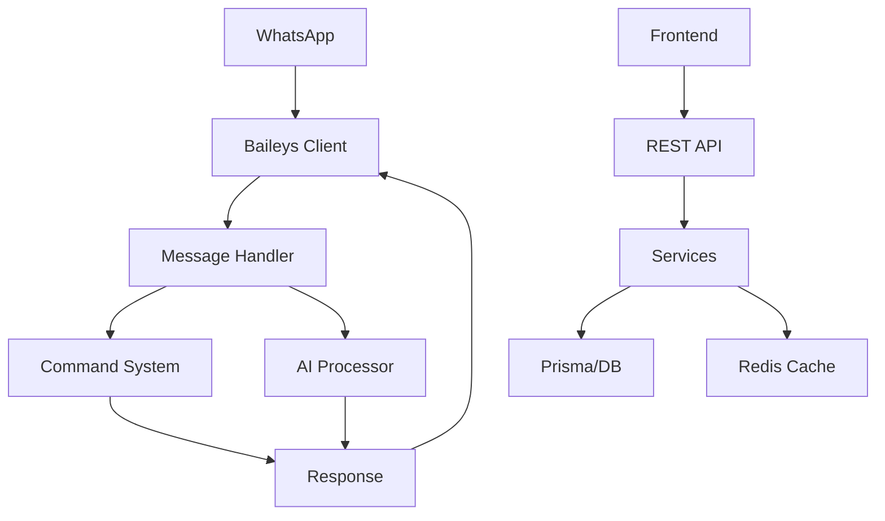

# WhatsDeX Architecture

This document provides an overview of the WhatsDeX codebase architecture.

## Tech Stack

| Layer           | Technology                 |
| --------------- | -------------------------- |
| **Bot Engine**  | Baileys (WhatsApp Web API) |
| **Backend**     | Node.js, Express 5         |
| **Frontend**    | Next.js                    |
| **Database**    | PostgreSQL + Prisma ORM    |
| **Cache/Queue** | Redis + Bull               |
| **AI**          | Google Gemini, OpenAI      |
| **Payments**    | Stripe                     |

---

## Directory Structure

```
WhatsDeX/
├── backend/                 # Backend application
│   ├── commands/           # 23 command categories (~238 commands)
│   ├── routes/             # REST API routes (ESM)
│   ├── middleware/         # Express middleware
│   ├── src/
│   │   ├── services/       # Business logic services
│   │   ├── utils/          # Utility functions
│   │   └── lib/            # Core libraries
│   └── prisma/             # Database schema
│
├── frontend/               # Next.js dashboard
│   ├── app/               # Next.js app router
│   ├── components/        # React components
│   └── lib/               # Frontend utilities
│
├── deployment/            # Docker, nginx configs
└── scripts/               # Utility scripts
```

---

## Service Architecture



---

## Key Services

| Service                | Purpose                            |
| ---------------------- | ---------------------------------- |
| `UnifiedCommandSystem` | Command registration and execution |
| `UnifiedAIProcessor`   | AI model integration               |
| `SessionManager`       | WhatsApp session handling          |
| `AnalyticsService`     | Real-time metrics + WebSocket      |
| `MultiTenantService`   | SaaS tenant management             |
| `StripeService`        | Payment processing                 |

---

## Module System

All files use **ES Modules (ESM)**:

- `import/export` syntax
- `.js` extensions required in imports
- Barrel exports in `services/index.js` and `utils/index.js`

---

## API Endpoints

| Route             | Purpose                          |
| ----------------- | -------------------------------- |
| `/api/auth`       | Authentication, QR/pairing codes |
| `/api/users`      | User management                  |
| `/api/analytics`  | Metrics and dashboards           |
| `/api/moderation` | Content moderation               |
| `/api/settings`   | System configuration             |
| `/api/audit`      | Audit logs                       |

---

## Getting Started

```bash
# Install dependencies
npm install

# Generate Prisma client
npm run generate

# Start development
npm run start:smart
```
