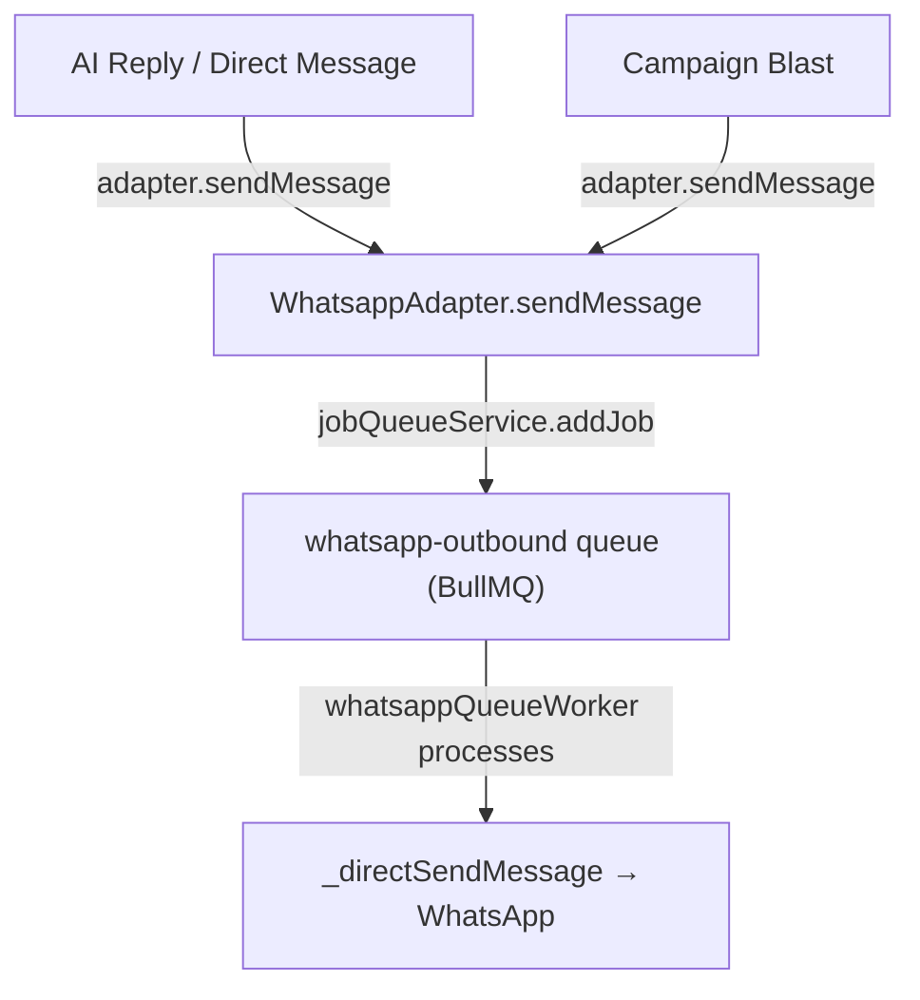

# Internal Anti-Ban Engine — Implementation Plan (Revised)

## Background
Protect DeXMart's server IP from WhatsApp bans by intercepting outbound traffic at the Application Layer. Instead of buying proxy IPs, we build an intelligent **Outbound Spam Firewall** modeled after enterprise ESPs like SendGrid.

## Full Codebase Audit Results

### Existing Outbound Message Flow (2 Paths)

> [!IMPORTANT]
> **ALL WhatsApp messages** (AI replies, campaigns, direct sends) funnel through `whatsapp-outbound` via [WhatsappAdapter.ts:349-364](file:///w:/CodeDeX/DeXMart/backend/src/services/channels/whatsapp/WhatsappAdapter.ts#L349-L364). The BullMQ `campaigns` queue only handles campaign scheduling/batching, NOT the actual message dispatch.

### What Already Exists (DO NOT duplicate)

| Feature | File | Status |
|---|---|---|
| Human-like typing delay (2-10s per msg) | [whatsappQueueWorker.ts:24-37](file:///w:/CodeDeX/DeXMart/backend/src/workers/whatsappQueueWorker.ts#L24-L37) | ✅ Active |
| Campaign batch pacing (`minDelay`, `maxDelay`) | [campaignWorker.ts:158-161](file:///w:/CodeDeX/DeXMart/backend/src/jobs/campaignWorker.ts#L158-L161) | ✅ Active |
| Campaign batch pausing (`batchPauseMin/Max`) | [campaignWorker.ts:170-174](file:///w:/CodeDeX/DeXMart/backend/src/jobs/campaignWorker.ts#L170-L174) | ✅ Active |
| Working hours enforcement | [campaignWorker.ts:101-112](file:///w:/CodeDeX/DeXMart/backend/src/jobs/campaignWorker.ts#L101-L112) | ✅ Active |
| AI message spinning (Spintax) | [campaignWorker.ts:265-268](file:///w:/CodeDeX/DeXMart/backend/src/jobs/campaignWorker.ts#L265-L268) | ✅ Active |
| Composing/paused presence simulation | [whatsappQueueWorker.ts:34-40](file:///w:/CodeDeX/DeXMart/backend/src/workers/whatsappQueueWorker.ts#L34-L40) | ✅ Active |

### What's MISSING (What We Build)

| Feature | Where | Description |
|---|---|---|
| **The Velocity Rule** | [whatsappQueueWorker.ts](file:///w:/CodeDeX/DeXMart/backend/src/workers/whatsappQueueWorker.ts) | Global per-tenant rate limiter: max X messages per Y seconds using Redis sliding window. Enforces 5-7s gaps. |
| **The Content Rule** | [campaignWorker.ts](file:///w:/CodeDeX/DeXMart/backend/src/jobs/campaignWorker.ts) | Hash message body before dispatch. If identical hash count exceeds threshold → pause campaign + alert. |
| **Cooldown + Resume UI** | Frontend `CampaignDashboard` | When paused by Anti-Ban: show countdown timer. Free users click "Resume" manually. Premium users toggle "Auto-Resume". |

---

## Proposed Changes

### 1. The Velocity Rule — Global Rate Limiter

#### [MODIFY] [whatsappQueueWorker.ts](file:///w:/CodeDeX/DeXMart/backend/src/workers/whatsappQueueWorker.ts)

Before processing each job, check a Redis sliding window counter keyed by `antiban:velocity:{tenantId}`:
- If `messageCount` in the last 60 seconds exceeds the tenant's rate limit → delay the job (re-queue with backoff).
- Default limit: **1 message per 5-7 seconds** (randomized within range).
- This catches ALL outbound WhatsApp traffic (AI replies, campaigns, direct sends).

#### [NEW] [antiBanService.ts](file:///w:/CodeDeX/DeXMart/backend/src/services/antiBanService.ts)

Centralized Anti-Ban logic service:
- `checkVelocity(tenantId)` → Redis `INCR` + `EXPIRE` sliding window.
- `checkContentHash(tenantId, campaignId, messageBody)` → Redis `INCR` on `antiban:hash:{tenantId}:{hash}`.
- `triggerCooldown(tenantId, campaignId, reason)` → Pause campaign, emit socket alert, log event.

---

### 2. The Content Rule — Message Hash Deduplication

#### [MODIFY] [campaignWorker.ts](file:///w:/CodeDeX/DeXMart/backend/src/jobs/campaignWorker.ts)

Inside [processCampaign](file:///w:/CodeDeX/DeXMart/backend/src/jobs/campaignWorker.ts#74-179), before the dispatch loop (line 134):
- Hash the **template content** (after variable substitution but before AI spinning).
- Track hash count in Redis via `antiBanService.checkContentHash()`.
- If identical hash count > threshold → call `triggerCooldown()`.

> [!NOTE]
> The Content Rule only applies to **Campaigns**, not AI replies. AI replies are unique conversational responses and won't trigger similarity detection.

---

### 3. Cooldown + Resume (Premium Tier)

#### [MODIFY] Campaign Frontend Components

When a campaign is paused by the Anti-Ban engine:
- Emit a WebSocket event with `reason: 'antiban'` and `cooldownSeconds`.
- Frontend shows: "⚠️ Campaign paused to protect your number. Resuming in X:XX..."
- **Free/Starter tier:** "Resume" button is disabled until cooldown reaches 0. User must manually click.
- **Premium tier:** "Auto-Resume" toggle. When enabled, the system automatically re-queues the campaign after cooldown.

---

## User Decisions (Confirmed)

| Decision | Answer |
|---|---|
| Velocity delay | 5-7 seconds between messages (randomized) |
| Content threshold | Regulated by frequency + AI spinning (no hard number) |
| Penalty | Pause campaign + alert user with explanation |
| Premium feature | Free users manually resume; Premium users auto-resume |

## Verification Plan

### Automated
1. Unit test `antiBanService.checkVelocity()` with mock Redis.
2. Unit test `antiBanService.checkContentHash()` with duplicate messages.

### Manual
1. Send 10 rapid messages → verify they are paced at 5-7s intervals.
2. Create a campaign with identical messages to 20 contacts → verify the Content Rule logs a warning (without pausing, since AI spinning is enabled by default).
3. Disable AI spinning → re-run campaign → verify it pauses after threshold.
